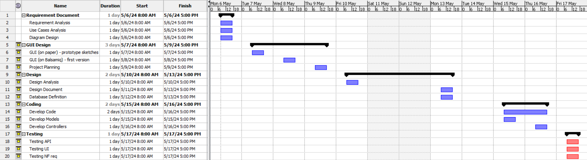

# Project Estimation - CURRENT

Date: 05/05/2024

Version: 1

# Estimation approach

Consider the EZElectronics project in CURRENT version (as given by the teachers), assume that you are going to develop the project INDEPENDENT of the deadlines of the course, and from scratch

# Estimate by size

###

|                                                                                                         | Estimate |
| ------------------------------------------------------------------------------------------------------- | -------- |
| NC = Estimated number of classes to be developed                                                        | 10       |
| A = Estimated average size per class, in LOC                                                            | 150      |
| S = Estimated size of project, in LOC (= NC \* A)                                                       | 1500     |
| E = Estimated effort, in person hours (here use productivity 10 LOC per person hour)                    | 150      |
| C = Estimated cost, in euro (here use 1 person hour cost = 30 euro)                                     | 4500 €   |
| Estimated calendar time, in calendar weeks (Assume team of 4 people, 8 hours per day, 5 days per week ) | ~ 1 week |

E = 1500 / 10 = 37.5

Estimated calendar time:

**E = 150 person/hour -> 37,5 hours per person -> 4 days and 4h per person ~ 1 week**

# Estimate by product decomposition

###

| component name       | Estimated effort (person hours) |
| -------------------- | ------------------------------- |
| requirement document | 15                              |
| GUI prototype        | 8                               |
| design document      | 4                               |
| code                 | 40                              |
| unit tests           | 7                               |
| api tests            | 9                               |
| management documents | 3                               |

# Estimate by activity decomposition

###

| Activity name                             | Estimated effort (person hours) |
| ----------------------------------------- | ------------------------------- |
| **Requirements planning**                 |                                 |
| Stakeholders/Actors analysis              | 5                               |
| Requirements analysis                     | 10                              |
| Use cases analysis                        | 15                              |
| Diagrams design                           | 5                               |
| **GUI Design**                            |                                 |
| GUI (on paper) - prototype sketches       | 2                               |
| GUI (on Balsamiq) - first version         | 8                               |
| Project planning and resources assignment | 5                               |
| **Design**                                |                                 |
| Design analysis                           | 5                               |
| Design document                           | 5                               |
| Database definition                       | 5                               |
| **Implementation**                        |                                 |
| Develop code                              | 25                              |
| Developing models                         | 5                               |
| Developing controllers                    | 10                              |
| **TESTING**                               |                                 |
| Testing API                               | 9                               |
| Testing UI                                | 5                               |
| Testing of NF req                         | 5                               |

###

# Summary

Report here the results of the three estimation approaches. The estimates may differ. Discuss here the possible reasons for the difference

|                                    | Estimated effort | Estimated duration |
| ---------------------------------- | ---------------- | ------------------ |
| estimate by size                   |                  |
| estimate by product decomposition  |                  |
| estimate by activity decomposition |                  |
