# Graphical User Interface Prototype - CURRENT

Authors:
- Gino Fachichi
- Laura Llinares
- Alessandro Rizzo
- Sarvnaz Roumianfar

Date: 05/05/2024

Version: v1

\<Report here the GUI that you propose for EZElectronics in CURRENT form, as received by teachers. You are free to organize it as you prefer. A suggested presentation matches the Use cases and scenarios defined in the Requirement document. The GUI can be shown as a sequence of graphical files (jpg, png) >

# Home page

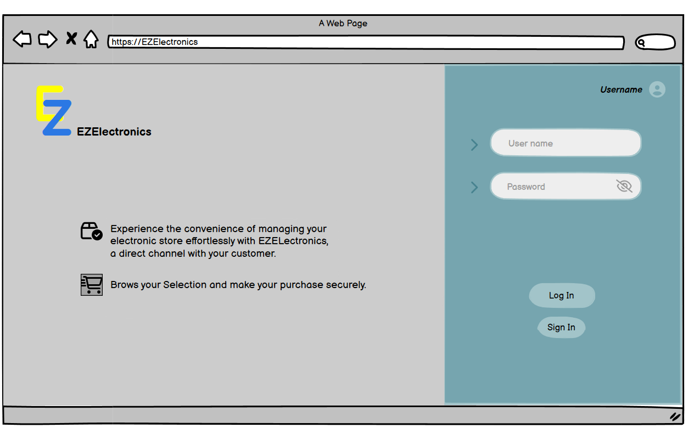

# Sign Up
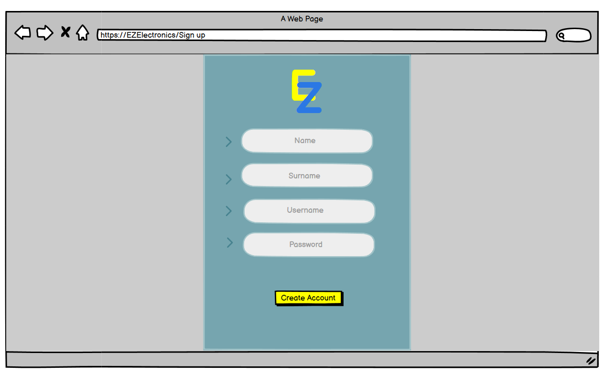

# Customer 

### Products list 

### Products details

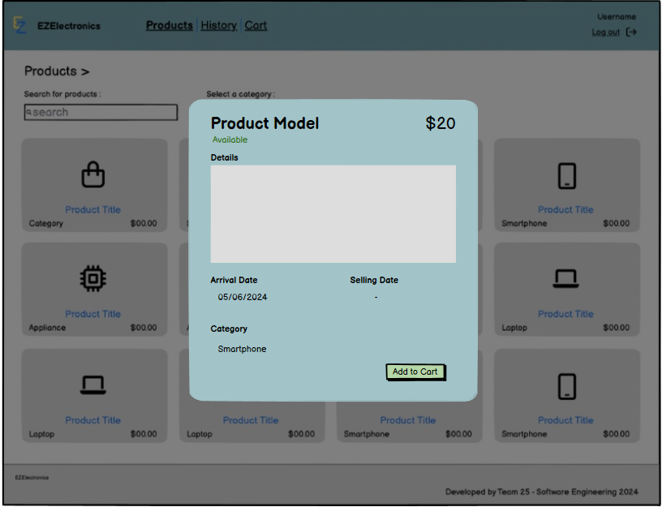

### Cart

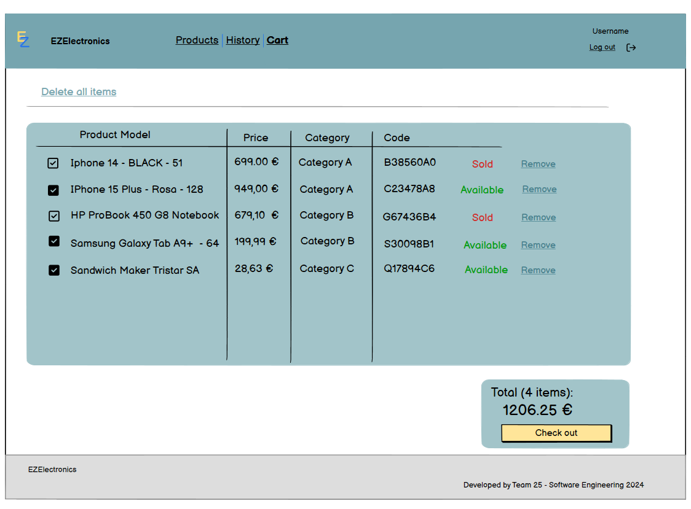

### Checkout confirmation

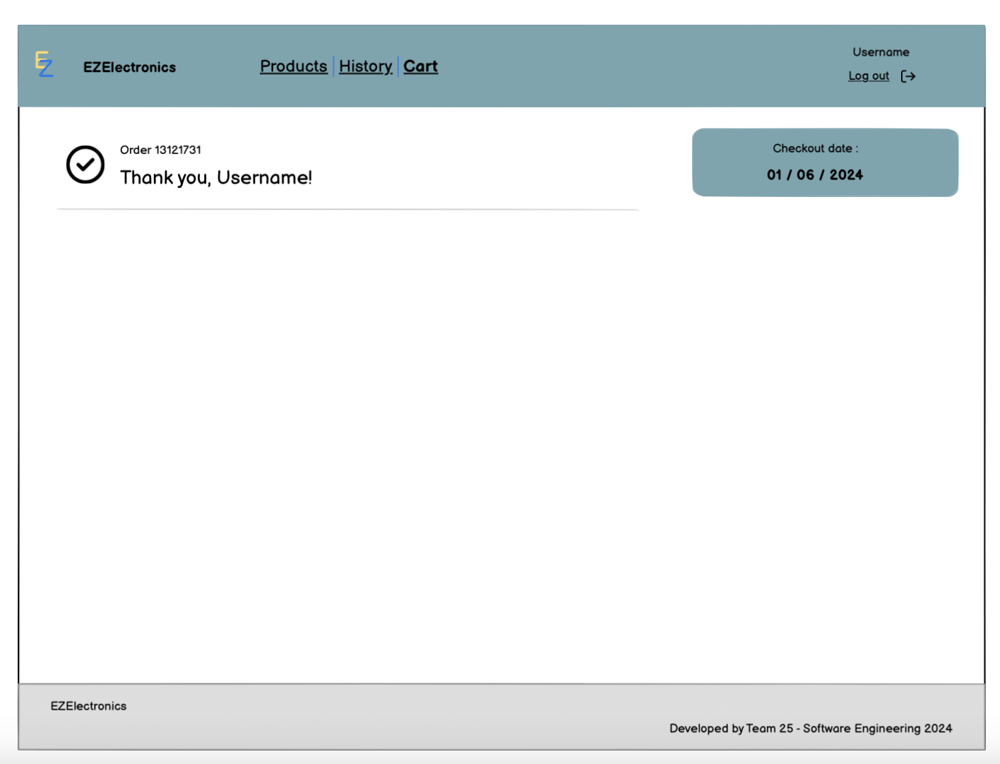

### Cart History 

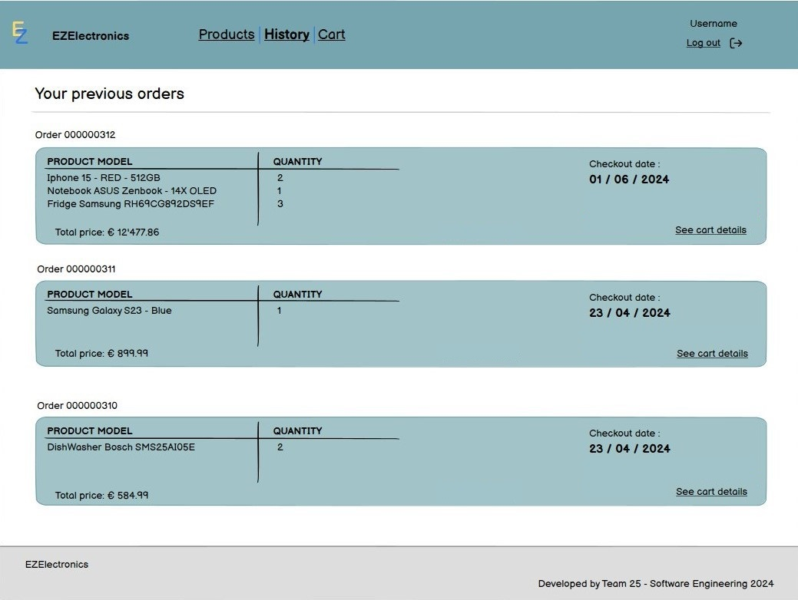

--- 
# Manager 

### Products list 

When the manager enters the website, the landing page is the list of all the products.

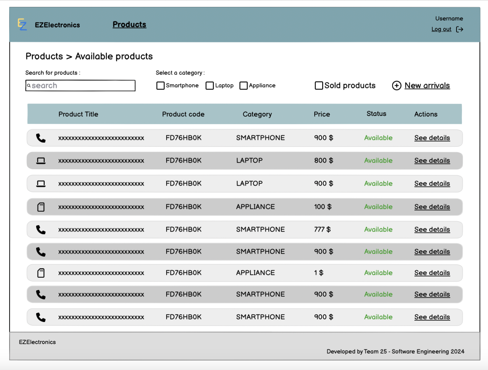

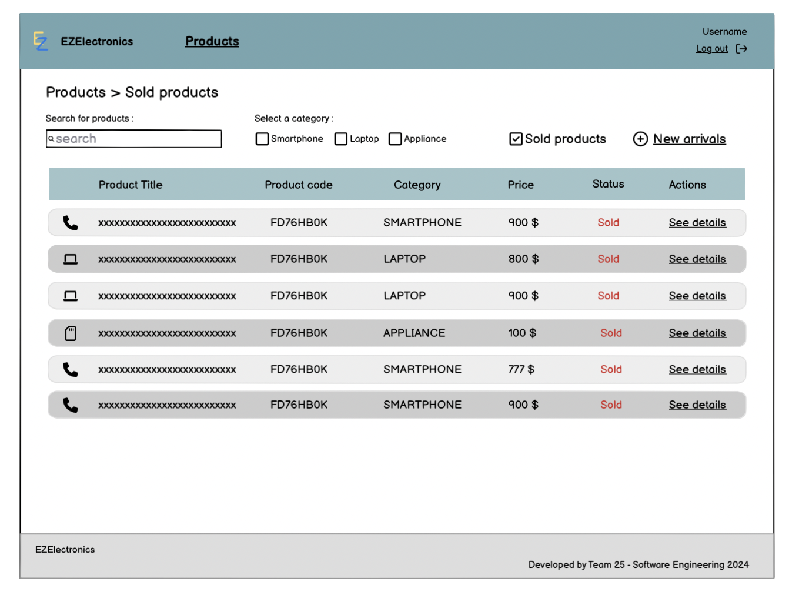

They can click on one product to see all the details and the available action (delete and sell).

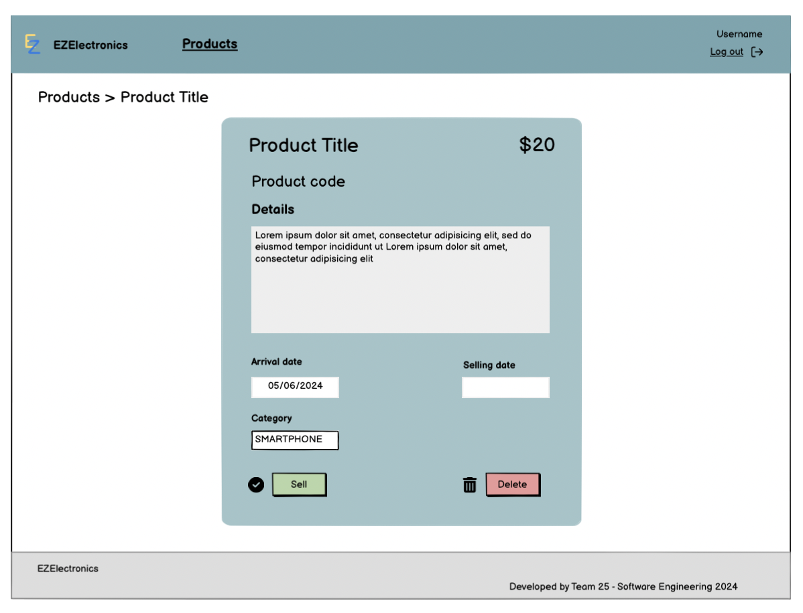

They can click on the "New arrival" dropdown and select "Register a product" or "Register an arrival" to add new products to the inventory:

"Register a product"

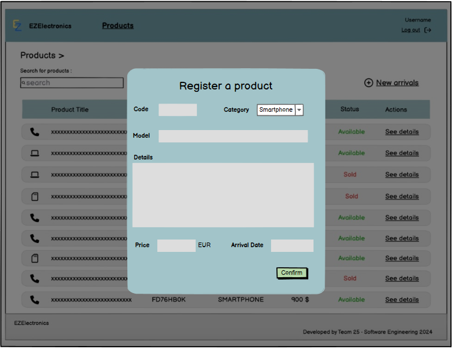

"Register an arrival"

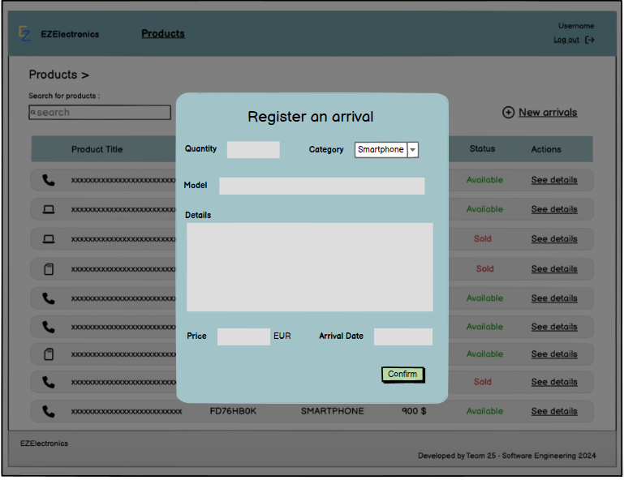

