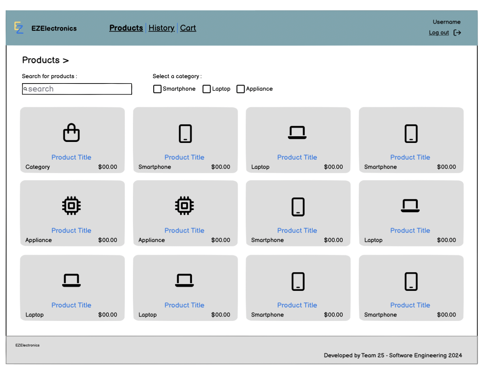
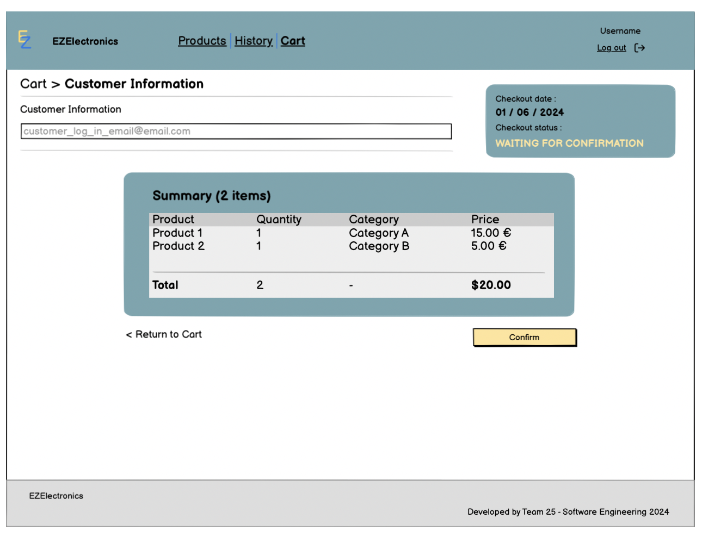
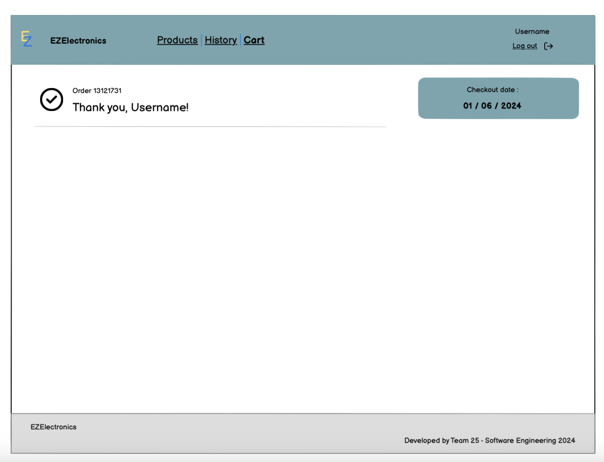
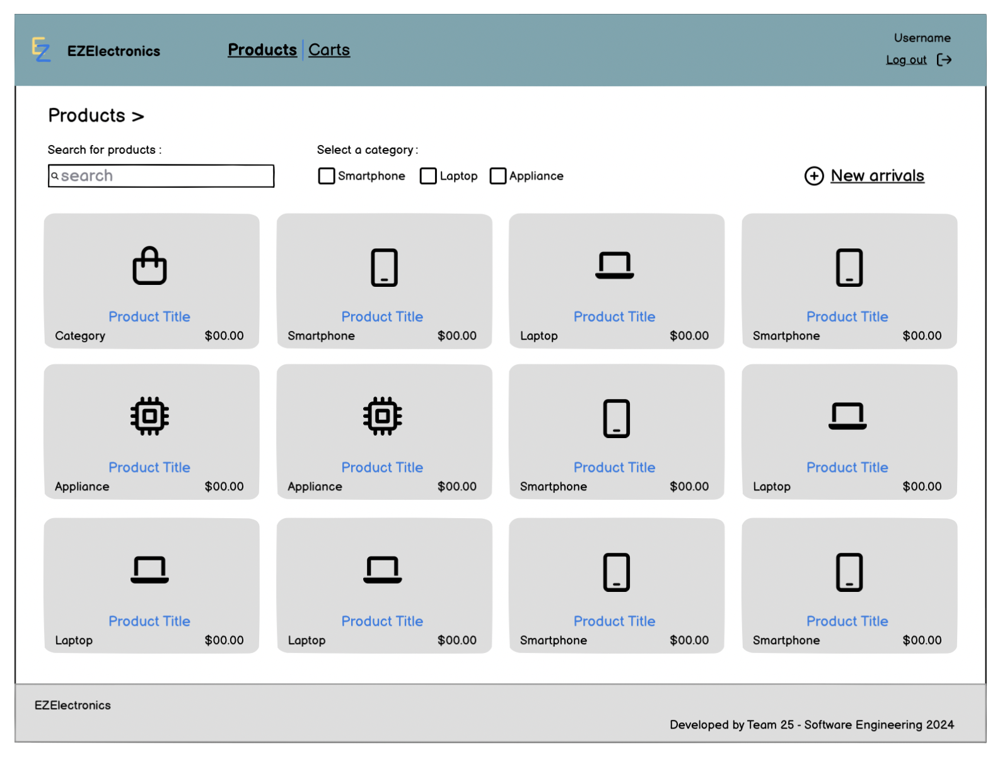
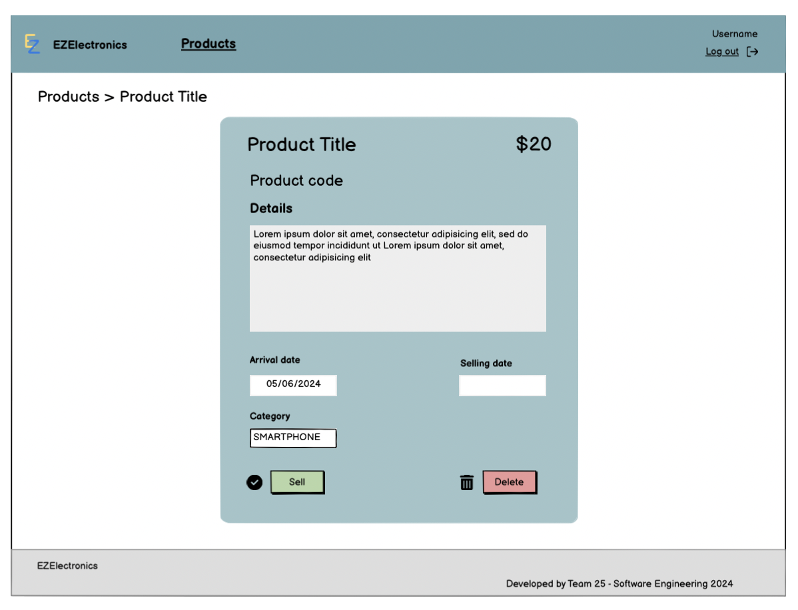

# Graphical User Interface Prototype - CURRENT

Authors:

Date:

Version:

\<Report here the GUI that you propose for EZElectronics in CURRENT form, as received by teachers. You are free to organize it as you prefer. A suggested presentation matches the Use cases and scenarios defined in the Requirement document. The GUI can be shown as a sequence of graphical files (jpg, png) >

# Customer 

### Products list 

### Checkout cart 

When the customer completes his cart, he can proceed to checkout his cart.

After clicking on the confirmation button. The user has to wait for manager's approval.

--- 
# Manager 

### Products list 

When the manager enters the website, the landing page is the list of all the products.

He can click on one product to see all the details and the available action (delete).

