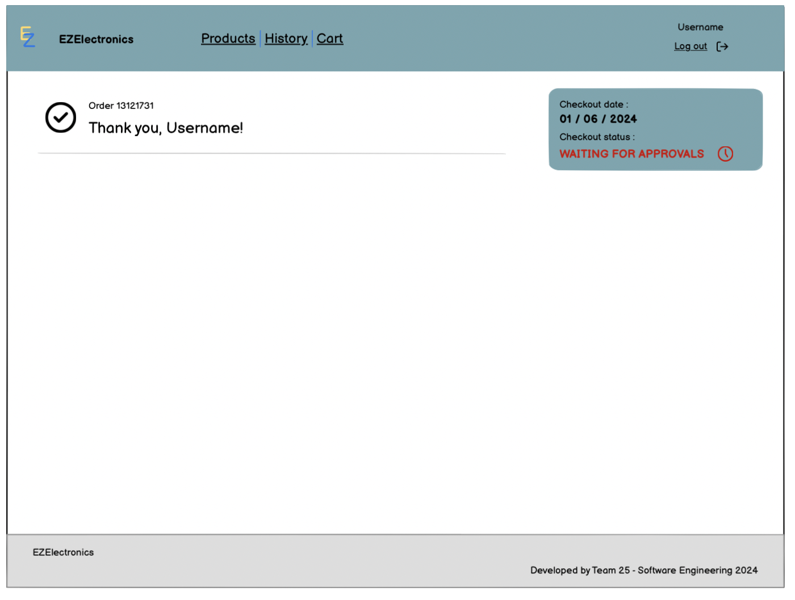

# Graphical User Interface Prototype - CURRENT

Authors:

Date:

Version:

\<Report here the GUI that you propose for EZElectronics in CURRENT form, as received by teachers. You are free to organize it as you prefer. A suggested presentation matches the Use cases and scenarios defined in the Requirement document. The GUI can be shown as a sequence of graphical files (jpg, png) >

# Customer 

### Checkout cart 
When the customer complete his cart, he can proceed to checkout his cart.

After clicking on the confirmation button. The user has to wait for manager's approval.

--- 
# Manager 