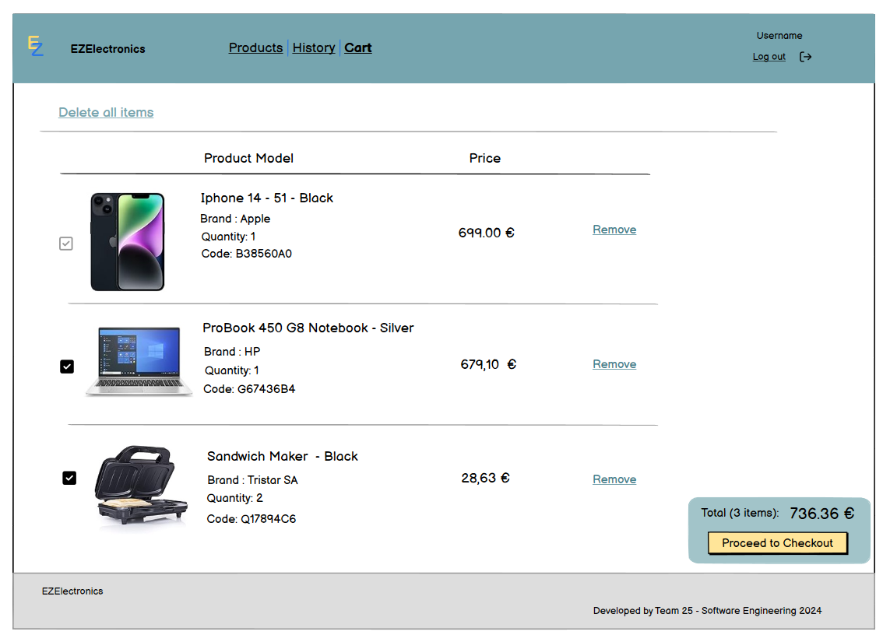
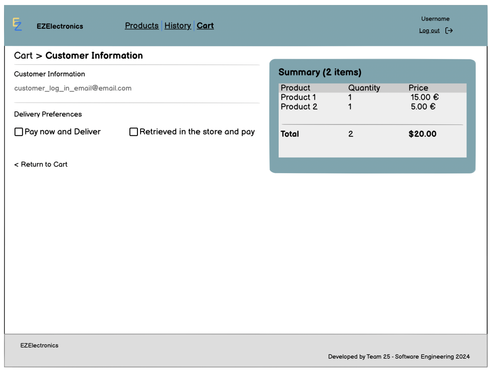

# Graphical User Interface Prototype - CURRENT

Authors:
- Gino Fachichi
- Laura Llinares
- Alessandro Rizzo
- Sarvnaz Roumianfar

Date: 05/05/2024

Version: v2

\<Report here the GUI that you propose for EZElectronics in CURRENT form, as received by teachers. You are free to organize it as you prefer. A suggested presentation matches the Use cases and scenarios defined in the Requirement document. The GUI can be shown as a sequence of graphical files (jpg, png) >

# Home page

 # Sign up

# Customer 

### Products list 

### Products details

### Cart

### Cart History

### Checkout

At checkout, customers have two options:
- Pay online for delivery.
- Opt to retrieve their order and pay at the store: However, they are required to prepay €5, and retrieve the order within a week. This measure helps prevent fraudulent customers from checking out multiple products online, which may render them unavailable.

#### OPTION 1 : Pay online for delivery.

He can also use another address.

#### OPTION 2 : Opt to retrieve their order and pay at the store.

### Payment

--- 
# Manager 

### Products list 

When the manager enters the website, the landing page is the list of all the products.

### Product detail

They can click on one product to see all the details and the available action (delete product).

### Product registration

They can click on the "New arrival" dropdown and select "Register a product" or "Register an arrival" to add new products to the inventory:

"Register a product"

"Register an arrival"

### Customer checkout 

The manager can see the state of all cart and manage them. He can also track if customer already paid or not.

