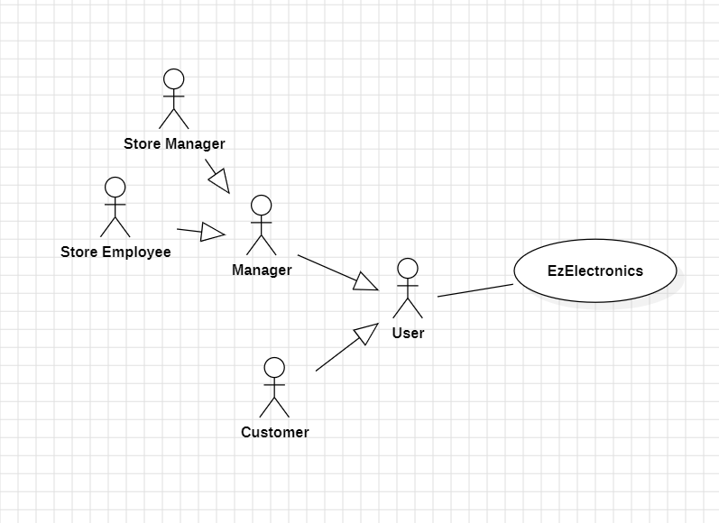
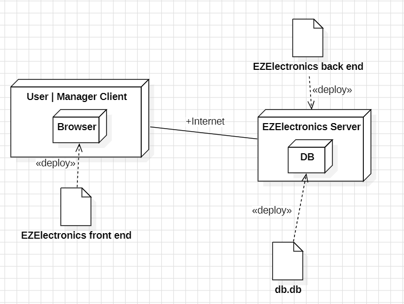

# Requirements Document - current EZElectronics

Date:

Version: V1 - description of EZElectronics in CURRENT form (as received by teachers)

| Version number |            Change             |
| :------------: | :---------------------------: |
|       1        | Created Requirements Document |

# Contents

- [Requirements Document - current EZElectronics](#requirements-document---current-ezelectronics)
- [Contents](#contents)
- [Informal description](#informal-description)
- [Stakeholders](#stakeholders)
- [Context Diagram and interfaces](#context-diagram-and-interfaces)
  - [Context Diagram](#context-diagram)
  - [Interfaces](#interfaces)
- [Stories and personas](#stories-and-personas)
- [Functional and non functional requirements](#functional-and-non-functional-requirements)
  - [Functional Requirements](#functional-requirements)
  - [Non Functional Requirements](#non-functional-requirements)
- [Use case diagram and use cases](#use-case-diagram-and-use-cases)
  - [Use case diagram](#use-case-diagram)
    - [Use case 1, UC1](#use-case-1-uc1)
      - [Scenario 1.1](#scenario-11)
      - [Scenario 1.2](#scenario-12)
      - [Scenario 1.x](#scenario-1x)
    - [Use case 2, UC2](#use-case-2-uc2)
    - [Use case x, UCx](#use-case-x-ucx)
- [Glossary](#glossary)
- [System Design](#system-design)
- [Deployment Diagram](#deployment-diagram)

# Informal description

EZElectronics (read EaSy Electronics) is a software application designed to help managers of electronics stores to manage their products and offer them to customers through a dedicated website. Managers can assess the available products, record new ones, and confirm purchases. Customers can see available products, add them to a cart and see the history of their past purchases.

# Stakeholders

|     Stakeholder name      |                                 Description                                 |
| :-----------------------: | :-------------------------------------------------------------------------: |
|         Customer          |                            Customer of the shop                             |
|          Store Manager          |                             Manager of the shop                             |
| Store Employee | Employee of the shop |
|     Product companies     |             Company producing the products sold on the website              |
| EzElectronics dev company |                The company that develops the website itself                 |
|        Competitors        | Other companies that want to develop similar softwares for the same purpose |

# Context Diagram and interfaces

## Context Diagram

## Interfaces

\<GUIs will be described graphically in a separate document>

|  Actor   | Logical Interface | Physical Interface |
| :------: | :---------------: | :----------------: |
| Customer |        GUI        |         PC         |
| Manager  |        GUI        |         PC         |

# Stories and personas 

-Brenda is 43 y/o, and she is the manager in the electronics shop of her town. She has been working every day with great efficiency and constancy to reach this position. She has troubles keeping track of the different products in the shop and she always complains with her employees because they often forget to update the status orders of the items in the shop.

-Emily is a 28-year-old elementary school teacher who's passionate about education and technology. As a teacher, Emily seeks electronic products that can enhance her classroom teaching. Emily often browses the EzElectronic website during her free time. She explores categories like "Laptops". While Emily wants quality products, she's mindful of her budget as a teacher. She looks for good value options that fit within her classroom budget. If she finds a laptop that fits her needs, Emily adds it to her cart and continues browsing or proceeds to checkout.

# Functional and non functional requirements

## Functional Requirements

|  ID   | Description                                                                                   |
| :---: | :-------------------------------------------------------------------------------------------- |
| _FR1_ | User Management                                                                               |
| FR1.1 | Creates new User                                                                              |
| FR1.2 | Retrieves all users                                                                           |
| FR1.3 | Retrieves all users with a specific role                                                      |
| FR1.4 | Retrieves specific user                                                                       |
| FR1.5 | Deletes specific user                                                                         |
| _FR2_ | User Authentication                                                                           |
| FR2.1 | User Log_in/Log_out                                                                           |
| _FR3_ | Cart Management                                                                               |
| FR3.1 | Retrieves the cart for a specific user                                                        |
| FR3.2 | Adds a product to the user's cart                                                             |
| FR3.3 | Retrieves all carts/orders for a specific customer                                            |
| FR3.4 | Removes a product from the user's cart                                                        |
| FR3.5 | Deletes a specific cart                                                                       |
| _FR4_ | Product Management                                                                            |
| FR4.1 | Registers the arrival of a new set of products                                                |
| FR4.2 | Registers the arrival of a single new product                                                 |
| FR4.3 | Marks a product as sold                                                                       |
| FR4.4 | Returns all products, or only the ones that have been sold or not sold                        |
| FR4.5 | Returns all products of a specific category, or only the ones that have been sold or not sold |
| FR4.6 | Returns all products of a specific model, or only the ones that have been sold or not sold    |
| FR4.7 | Deletes a specific product                                                                    |
| FR4.8 | Returns a specific product by its code                                                        |

## Table of rights

| Function | Manager |          Customer          |
| -------- | :-----: | :------------------------: |
| FR1      |   yes   |         only FR1.1         |
| FR2      |   yes   |            yes             |
| FR3      |   no    |            yes             |
| FR4      |   yes   | FR4.4, FR4.5, FR4.6, FR4.8 |

## Non Functional Requirements

|  ID   | Type (efficiency, reliability, ..) |                                                          Description                                                           |   Refers to   |
| :---: | :--------------------------------: | :----------------------------------------------------------------------------------------------------------------------------: | :-----------: |
| NFR1  |             Efficiency             |                                    The loading of the website should take less than 3 secs                                     | All functions |
| NFR2  |             Efficiency             |                                  All functions on the website should take less than 0.5 secs                                   | All functions |
| NFR3  |             Usability              |              The Manager of the store should be able to use the website with no training in less than 10 minutes               |  FR1 and FR4  |
| NFR4  |             Usability              |                           The Client of the store should be able to use the website with no training                           |  FR2 and FR3  |
| NFR5  |            Portability             | The website should be compatible with different browsers (Chrome, Mozilla, Safari, Edge, Opera...) releases from at least 2023 | All functions |
| NFR6  |            Portability             |             The website should be compatible with different devices (Desktops, laptops, tablets, and smartphones)              | All functions |
| NFR7  |            Availability            |             Availability of the service at least 95% (should manage well the communication with the local server)              |    ALL FR     |
| NFR8  |             Robustness             |                           The time to restart the website after a failure should be under 5 minutes                            |    ALL FR     |
| NFR9  |              Privacy               |                       Employees and company private data should not be disclosed outside the application                       |  FR2 and FR3  |
| NFR10 |               Domain               |                             The category of a product should only be Smartphone, Laptop, Appliance                             |      FR4      |
| NFR11 |               Domain               |                                     The role of a user should only be Manager or Customer                                      |      FR2      |
| NFR12 |              Security              |                        During login a message should be sent if the inserted Username/Password is wrong                        |      FR2      |
| NFR13 |              Security              |        A 401 error message should be displayed if a user tries to access all the in-domain webpages without logging in         |      FR2      |
| NFR14 |              Security              |                        Employees and managers passwords should be encrypted when saved on the database                         |      FR2      |
| NFR15 |              Security              |                 An error message should be displayed if a user tries to sign in with an already used username                  |      FR2      |

# Use case diagram and use cases

## Use case diagram

### UC1 - Use Case 1: Add product to cart

| Actors Involved  |                          Customer                           |
| :--------------: | :---------------------------------------------------------: |
|   Precondition   | The user must be authenticated and a have "customer" (role)   The product is in inventory and has not already been sold   The Product is not in another customer cart |
|  Post condition  |        The cart contains the requested product        |
| Nominal Scenario |      The user add the product successfully to their cart      |
|     Variants     |           The user adds **n** items of the same Product to their cart            |
|    Exceptions    |     |

##### Scenario 1.1: Add 1 product to cart

|  Scenario 1.1  |                The user add 1 Product to their cart                |
| :------------: | :--------------------------------------------------------------: |
|  Precondition  |   The user must be authenticated and a have "customer" (role)   The product is in inventory and has not already been sold   The Product is not in another customer cart    |
| Post condition |          The cart should contain the requested product           |
|     Step#      |                         **Description**                          |
|       1        |                The customer navigates to "Product" section                |
|       2        |      The customer clicks on one product -> product details       |
|       3        |               The customer clicks on "Add to cart"               |
|       4        |         The system updates the cart and adds the product          |

##### Scenario 1.2: Add n items of a product to cart

|  Scenario 1.2  |           The user add n items of a product to their cart            |
| :------------: | :---------------------------------------------------------------: |
|  Precondition  |    The user must be authenticated and a have "customer" (role)   There are n available items for the Product   |
| Post condition |        The cart should contain the **n** requested product        |
|     Step#      |                          **Description**                          |
|       1        |                The customer navigates to "Product" section                 |
|       2        |                The customer clicks on one product -> product details                 |
|       3        |         The customer selects the number of items to add          |
|       4        |               The customer clicks on "Add to cart"                |
|       5        |         The system updates the cart and adds the products          |

### UC2 - Use case 2: Register a new product

| Actors Involved  |                                        Manager                                        |
| :--------------: | :-----------------------------------------------------------------------------------------: |
|   Precondition   |                     Manager is authenticated and has the "manager" role                     |
|  Post condition  |                           The new product is added to the inventory                        |
| Nominal Scenario |                The manager adds a new product with all required information                 |
|     Variants     |                   The manager adds a new product with additional details                    |
|    Exceptions    | Product with the same code already exists   Required fields are not filled out correctly |

##### Scenario 2.1: Register a new product

|  Scenario 2.1  |                   Manager adds a new product to the inventory                    |
| :------------: | :---------------------------------------------------------------------------: |
|  Precondition  |              Manager is authenticated and has the "manager" role              |
| Post condition |                    The new product is added to the inventory                 |
|     Step#      |                                **Description**                                |
|       1        |                  The manager navigates to "Product" section                   |
|       2        |               The manager selects on the "New arrival" dropdown               |
|       3        |                   The manager selects "Register a product"                    |
|       4        | The manager enters product information (sale price, model, category, arrival date, etc.) |
|       5        |                       The manager saves the new product                       |
|       6        |                 The system adds the product to the inventory                  |

### UC3 - Use Case 3: View Cart History

| Actors Involved  |                                  Customer                                  |
| :--------------: | :------------------------------------------------------------------------: |
|   Precondition   |         The customer is authenticated and has the "customer" role          |
|  Post condition  |                  The customer can view their cart history (only checked out carts)            |
| Nominal Scenario | The customer accesses and views their cart history  |
|     Variants     |                                                                            |
|    Exceptions    |                 No cart history available for the customer                 |

##### Scenario 3.1: View Cart history

|  Scenario 3.1  |                   Customer views cart history                   |
| :------------: | :-------------------------------------------------------------: |
|  Precondition  |    The customer is authenticated and has the "customer" role    |
| Post condition | The customer can view their cart history (only checked out carts) |
|     Step#      |                         **Description**                         |
|       1        |           The customer navigates to "History" section           |
|       2        |     The customer sees a list of their past checked out cart     |
|       3        |     The customer clicks on a specific cart to view details     |

### UC4 - Use Case 4: Register arrival of n items of the same Product

| Actors Involved  |                                           Manager                                           |
| :--------------: | :-----------------------------------------------------------------------------------------: |
|   Precondition   |                    The user is authenticated and has the "manager" role                     |
|  Post condition  |                         All the products are added to the inventory                      |
| Nominal Scenario |              The manager adds **n** items of the same product to the inventory              |
|     Variants     |                The manager adds 1 item of the same product to the inventory                 |
|    Exceptions    | Required fields are not filled out correctly |

##### Scenario 4.1: Register arrival of n items of the same Product

|  Scenario 4.1  |                          Manager views cart history                           |
| :------------: | :---------------------------------------------------------------------------: |
|  Precondition  |             The user is authenticated and has the "manager" role              |
| Post condition |                  All the products are added to the inventory               |
|     Step#      |                                **Description**                                |
|       1        |                  The manager navigates to "Product" section                   |
|       2        |               The manager selects on the "New arrival" dropdown               |
|       3        |               The manager selects "Register an arrival"                |
|       4        | The manager enters product information (sale price, model, category, arrival date, etc.) |
|       5        |       The manager enters the quantity of products in the arrival       |
|       6        |                         The manager save the arrival                          |
|       7        |      The system adds all the products to the inventory with different identification codes       |

### UC5 - Use Case 5: Delete Product from Inventory

| Actors Involved  |                       Manager                        |
| :--------------: | :--------------------------------------------------: |
|   Precondition   | The user is authenticated and has the "manager" role   Product exists in the inventory  |
|  Post condition  |      The product is removed from the inventory       |
| Nominal Scenario |   The manager deletes a product from the inventory   |
|     Variants     |                                                      |
|    Exceptions    |              |

##### Scenario 5.1: Delete Product from Inventory

|  Scenario 5.1  |        Manager deletes a product from inventory        |
| :------------: | :----------------------------------------------------: |
|  Precondition  |  The user is authenticated and has the "manager" role   Product exists in the inventory  |
| Post condition |       The product is removed from the inventory        |
|     Step#      |                    **Description**                     |
|       1        |       The manager navigates to "Product" section       |
|       2        |   The manager searches for the product to be deleted   |
|       3        | The manager selects the product to delete -> product details |
|       4        | The manager selects the deletion option |
|       5        |   The system removes the product from the inventory    |

### UC6 - Use Case 6: Sell Product 

| Actors Involved  |                      Manager, Customer                       |
| :--------------: | :----------------------------------------------------------: |
|   Precondition   |   The manager is authenticated and has the "manager" role   The product is in inventory and has not already been sold    |
|  Post condition  |       The product is marked as sold       |
| Nominal Scenario | The manager marks a selected product as sold  |
|     Variants     |         The manager marks a selected product as sold, specifying arrival date  |
|    Exceptions    |  Invalid sale date  |

##### Scenario 6.1: Sell Product

|  Scenario 6.1  |        Manager sells a Product       |
| :------------: | :---------------------------------------------------------: |
|  Precondition  |   The manager is authenticated and has the "manager" role   The product is in inventory and has not already been sold      |
| Post condition |      The product is marked as sold      |
|     Step#      |                       **Description**                       |
|       1        |       The Customer communicates to the Manager the identification code of the Product they are buying |
|       2        |         The manager navigates to "Product" section         |
|       3        |   The manager searches for the product to be sold   |
|       4        | The manager selects the product to sell -> product details |
|       5        | The manager inserts a sale date (optional, default is current date) |
|       6        | The manager selects the sale option |
|       7        | The system marks the product as sold |

### UC7 - Use Case 7: Search for Product

| Actors Involved  |                  Customer, Manager                   |
| :--------------: | :--------------------------------------------------: |
|   Precondition   |   The user is authenticated as customer or manager   |
|  Post condition  |   The search results for the product are displayed   |
| Nominal Scenario | The user searches for a product by model or category |
|     Variants     |    The manager searches for an already sold product by model or category                          |
|    Exceptions    |    Product not found   Invalid search criteria    |

##### Scenario 7.1: Search for Product by category

|  Scenario 7.1  |             User searches for a product by category              |
| :------------: | :--------------------------------------------------------------: |
|  Precondition  |         The user is authenticated as customer or manager         |
| Post condition |         The search results for the product are displayed         |
|     Step#      |                         **Description**                          |
|       1        |            The user navigates to the "Product" section |
|       2        | The user selects a category from a dropdown (such as "Smartphone") |
|       3        |        The system displays all the available products of selected category        |

##### Scenario 7.2: Search for Product by model

|  Scenario 7.2  |                  User searches for a product by model                  |
| :------------: | :--------------------------------------------------------------------: |
|  Precondition  |            The user is authenticated as customer or manager            |
| Post condition |            The search results for the product are displayed            |
|     Step#      |                            **Description**                             |
|       1        |               The user navigates to the "Product" section |
|       2        |                        The user enters a model                         |
|       3        | The system displays all the available products which model corresponds to the input |

##### Scenario 7.3: Search for already sold Product, by model or by category

|  Scenario 7.3  |                  User searches for a product by model                  |
| :------------: | :--------------------------------------------------------------------: |
|  Precondition  |            The manager is authenticated as manager            |
| Post condition |            The search results for the product are displayed            |
|     Step#      |                            **Description**                             |
|       1        |               The manager navigates to the "Product" section               |
|       2        |                        The manager enters a model or selects a category                        |
|       3        | The manager checks the "sold" option to see only the already sold products  |
|       4        | The system displays all the already sold products which model corresponds to the input or with the selected category |

### UC8 - Use Case 8: Checkout Cart

| Actors Involved  |                         Customer                          |
| :--------------: | :-------------------------------------------------------: |
|   Precondition   | The customer is authenticated and has the "customer" role |
|  Post condition  |             The cart is marked as checked out and added to the customer's cart history   Current cart is emptied           |
| Nominal Scenario |      The customer checks out the product in their cart      |
|     Variants     |                                                           |
|    Exceptions    | Cart is empty   Not all product in cart have the current date as sale date  |

##### Scenario 8.1: Checkout Cart

|  Scenario 8.1  |                      Customer checks out the items in their cart                      |
| :------------: | :-----------------------------------------------------------------------------------: |
|  Precondition  |               The customer is authenticated and has the "customer" role              |
| Post condition |                           The cart is marked as checked out and added to the customer's cart history   Current cart is emptied                          |
|     Step#      |                                    **Description**                                    |
|       1        |                    The customer navigates to their "Cart" section                     |
|       2        |          The customer reviews the items in the cart and clicks on "checkout"           |
|       3        |                       The customer confirms the checkout action                       |
|       4        | The system marks the cart as checked out and adds it to the customer's cart history |
|       5        | Current cart is emptied |

### UC9 - Use Case 9: Remove Product from Cart

| Actors Involved  |                         Customer                          |
| :--------------: | :-------------------------------------------------------: |
|   Precondition   | The customer is authenticated and has the "customer" role   The product is in the cart   The cart is not in the cart history |
|  Post condition  |           The product is removed from the cart            |
| Nominal Scenario |      The customer removes a product from their cart       |
|     Variants     |                                                           |
|    Exceptions    |                              |

##### Scenario 9.1: Remove Product from Cart

|  Scenario 9.1  |                      Customer removes a product from their cart                      |
| :------------: | :----------------------------------------------------------------------------------: |
|  Precondition  |              The customer is authenticated and has the "customer" role   The product is in the cart   The cart is not in the cart history              |
| Post condition |                         The product is removed from the cart                         |
|     Step#      |                                   **Description**                                    |
|       1        |                    The customer navigates to their "Cart" section                    |
|       2        | The customer selects the product to remove from the cart and clicks on the icon to remove it |
|       3        |                   The customer confirms the removal of the product                   |
|       4        |                     The system removes the product from the cart                     |

### UC10 - Use Case 10: Delete Cart

| Actors Involved  |                         Customer                          |
| :--------------: | :-------------------------------------------------------: |
|   Precondition   | The customer is authenticated and has the "customer" role |
|  Post condition  |            The cart is deleted from the inventory           |
| Nominal Scenario |              The customer deletes their cart              |
|     Variants     |                                                           |
|    Exceptions    |                   Cart is already empty                   |

##### Scenario 10.1: Delete Cart

| Scenario 10.1  |                Customer deletes their cart                |
| :------------: | :-------------------------------------------------------: |
|  Precondition  | The customer is authenticated and has the "customer" role |
| Post condition |            The cart is deleted from the inventory            |
|     Step#      |                      **Description**                      |
|       1        |      The customer navigates to their "Cart" section       |
|       2        |    The customer selects the option to delete the cart     |
|       3        |      The customer confirms the deletion of the cart       |
|       4        |        The system removes the cart from the inventory        |

### UC11 - Use Case 11: Login

| Actors Involved  |                         Customer, Manager |
| :--------------: | :-------------------------------------------------------: |
|   Precondition   | The user is registered to the system either as customer or manager |
|  Post condition  | The user is authenticated as customer or manager        |
| Nominal Scenario | The user insert his credentials and logs in  |
|     Variants     |       The user inserts their credentials and is authenticated as customer     The user insert his credentials and is authenticated as manager      |
|    Exceptions    |                The credentials are not valid                  |

##### Scenario 11.1: Customer logs in

| Scenario 11.1  |                Customer logs in               |
| :------------: | :-------------------------------------------------------: |
|  Precondition  | The customer is registered to the system as customer|
| Post condition |            The customer is authenticated as customer         |
|     Step#      |                      **Description**                      |
|       1        |      The customer navigates to the login page       |
|       2        |    The customer inserts their credentials (username, password) and confirms    |
|       3        |      The system authenticates the customer as customer      |

##### Scenario 11.2: Manager logs in 

| Scenario 11.2  |                Manager logs in               |
| :------------: | :-------------------------------------------------------: |
|  Precondition  | The manager is registered to the system as manager|
| Post condition |            The manager is authenticated as manager         |
|     Step#      |                      **Description**                      |
|       1        |      The manager navigates to the login page       |
|       2        |    The manager inserts their credentials (username, password) and confirms   |
|       3        |      The system authenticates the manager as manager     |

### UC12 - Use Case 12: Sign in

| Actors Involved  |                         Customer                              |
| :--------------: | :-------------------------------------------------------: |
|   Precondition   | The Customer has an Internet connection |
|  Post condition  | The Customer is registered to the system        |
| Nominal Scenario | The Customer inserts their credentials (username, password, name, surname) and signs in as a customer  |
|     Variants     | |
|    Exceptions    |                 The credentials are not valid                |

##### Scenario 12.1: Customer signs in

| Scenario 12.1  |                Customer signs in               |
| :------------: | :-------------------------------------------------------: |
|  Precondition  | The customer has an Internet connection|
| Post condition |            The customer is registered to the system         |
|     Step#      |                      **Description**                      |
|       1        |      The customer navigates to the login page       |
|       2        |    The customer inserts their credentials (username, password, name, surname) and confirms    |
|       3        |      The system registrates the customer as customer      |

### UC14 - Use Case 14: Logout

| Actors Involved  |                         Customer, Manager |
| :--------------: | :-------------------------------------------------------: |
|   Precondition   | The user is authenticated to the system either as customer or manager |
|  Post condition  | The user is no more authenticated as customer or manager and they are redirected to login page        |
| Nominal Scenario | The user logs out  |
|     Variants     |       The user is authenticated as customer and logs out   The user is authenticated as manager and logs out      |
|    Exceptions    |                          |

##### Scenario 14.1: Customer logs out

| Scenario 14.1  |                Customer logs out               |
| :------------: | :-------------------------------------------------------: |
|  Precondition  | The customer is authenticated to the system as customer|
| Post condition |            The customer is no more authenticated as customer and they are redirected to login page        |
|     Step#      |                      **Description**                      |
|       1        |      The customer navigates to any page       |
|       2        |    The customer selects logout option and confirms     |
|       3        |      The authentication of the customer expires      |

##### Scenario 14.2: Manager logs out 

| Scenario 14.2  |                Manager logs out               |
| :------------: | :-------------------------------------------------------: |
|  Precondition  | The manager is authenticated to the system as manager|
| Post condition |            The manager is no more authenticated as manager and they are redirected to login page        |
|     Step#      |                      **Description**                      |
|       1        |      The manager navigates to any page       |
|       2        |    The manager selects logout option and confirms   |
|       3        |      The authentication of the manager expires     |

### UC15 - Use Case 15: View Product details

| Actors Involved  |                          Customer, Manager                           |
| :--------------: | :---------------------------------------------------------: |
|   Precondition   | The user must be authenticated as customer or manager   The product is in inventory |
| Nominal Scenario |      The details of a selected Product are desplayed     |
|     Variants     |           The user reads the details of a selected Product            |
|    Exceptions    |     |

##### Scenario 15.1: View Product details 

|  Scenario 15.1  |                The user views Product details                |
| :------------: | :--------------------------------------------------------------: |
|  Precondition  |   The user must be authenticated as customer or manager   The product is in inventory  |
| Post condition |          The details of a selected Product are desplayed          |
|     Step#      |                         **Description**                          |
|       1        |                The user navigates to their "Product" section               |
|       2        |      The user clicks on one product -> product details       |
|       3        |               The user reads the details of the selected Product               |

### UC16 - Use Case 16: View Cart

| Actors Involved  |                                  Customer                                  |
| :--------------: | :------------------------------------------------------------------------: |
|   Precondition   |         The customer is authenticated and has the "customer" role          |
|  Post condition  |                  The customer can view their cart, including its total price            |
| Nominal Scenario | The customer accesses and reviews their cart |
|     Variants     |                               The customer accesses and views their cart's total price                                             |
|    Exceptions    |        |

##### Scenario 16.1: View Cart

|  Scenario 3.1  |                   Customer views cart                   |
| :------------: | :-------------------------------------------------------------: |
|  Precondition  |    The customer is authenticated and has the "customer" role    |
| Post condition | The customer can view their cart, including its total price |
|     Step#      |                         **Description**                         |
|       1        |           The customer navigates to "Cart" section           |
|       2        |     The customer sees their cart     |
|       3        |   The customer sees the total price of their current purchase |

---

# Glossary

# System Design

Not required

# Deployment Diagram

