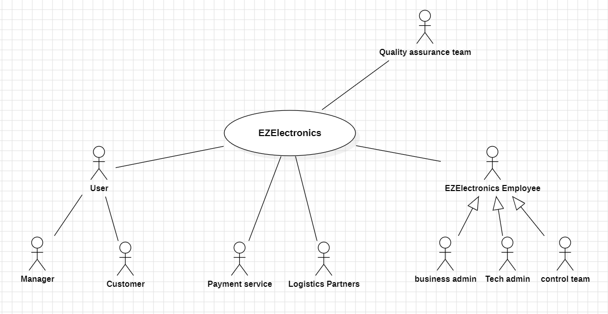
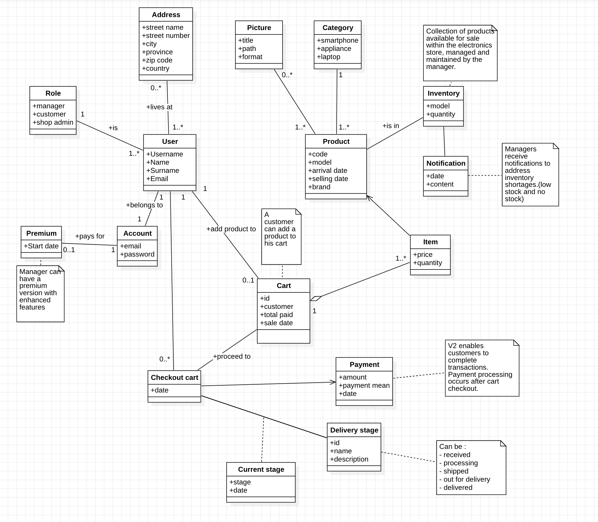

# Requirements Document - future EZElectronics

Date:

Version: V1 - description of EZElectronics in FUTURE form (as proposed by the team)

| Version number |                         Change                         |
| :------------: | :----------------------------------------------------: |
|       1        |             Created Requirements Document              |
|       2        | Added Business Model and payment method for Customers, |
|                |         Added product details, customer email,         |
|                |                  Various QOL changes                   |

# Contents

- [Requirements Document - future EZElectronics](#requirements-document---future-ezelectronics)
- [Contents](#contents)
- [Informal description](#informal-description)
- [Stakeholders](#stakeholders)
- [Context Diagram and interfaces](#context-diagram-and-interfaces)
  - [Context Diagram](#context-diagram)
  - [Interfaces](#interfaces)
- [Stories and personas](#stories-and-personas)
- [Functional and non functional requirements](#functional-and-non-functional-requirements)
  - [Functional Requirements](#functional-requirements)
  - [Non Functional Requirements](#non-functional-requirements)
- [Use case diagram and use cases](#use-case-diagram-and-use-cases)
  - [Use case diagram](#use-case-diagram)
    - [Use case 1, UC1](#use-case-1-uc1)
      - [Scenario 1.1](#scenario-11)
      - [Scenario 1.2](#scenario-12)
      - [Scenario 1.x](#scenario-1x)
    - [Use case 2, UC2](#use-case-2-uc2)
    - [Use case x, UCx](#use-case-x-ucx)
- [Glossary](#glossary)
- [System Design](#system-design)
- [Deployment Diagram](#deployment-diagram)

# Informal description

EZElectronics (read EaSy Electronics) is a software application designed to help managers of electronics stores to manage their products and offer them to customers through a dedicated website. Managers can assess the available products, record new ones, and confirm purchases. Customers can see available products, add them to a cart and see the history of their past purchases.

#### Key Features and Improvements:

- Low Stock and No Stock Alerts: Managers receive notifications to address inventory shortages.
- Product Visuals: V2 improves the product browsing experience by incorporating images and brand information for each listed item. 
- Total Stock Count: V2 provides a view of total stock counts.
- Post-Checkout Payment: V2 enables customers to complete transactions. Payment processing occurs after cart checkout.
- Shop Admin Role: V2 introduces a specialized shop admin role. Shop admins have restricted functionalities compared to managers, ensuring efficient delegation of responsibilities.
- Account Management: V2 add new fields for address and email information in user accounts. 
- Delivery Stage Tracking: Managers and shop admins can update delivery stages, providing customers with visibility into the status of their orders.
- Premium Account Option: Premium features offer new functionality.

# Stakeholders

|     Stakeholder name      |                                 Description                                  |
| :-----------------------: | :--------------------------------------------------------------------------: |
|         Customer          |                             Customer of the shop                             |
|          Manager          |                             Manager of the shop                              |
|     Product companies     |              Company producing the product sell on the website               |
|        Tech Admin         |                             Admin of the website                             |
|      Business admin       |                 Responsible for the marketing of the product                 |
|        Shop admin         | Responsible for managing product with less responsabilities than the manager |
| EzElectronics dev company |                The company that develops the software itself                 |
|        Competitors        | Other companies that want to develop similar softwares for the same purpose  |
|       Control Team        |                     Check stock, check available product                     |
|      Cloud provider       |                     Provider for hosting the application                     |
|  Quality assurance team   |           Group of people responsible for testing the application            |
| Payment Service  |                         For customer payment option                          |
|    Logistics Partners     |                       For show delivery stages option                        |
|   Customer Support Team   |                        Assisting customers with order                        |

# Context Diagram and interfaces

## Context Diagram

## Interfaces

\<describe here each interface in the context diagram>

\<GUIs will be described graphically in a separate document>

|          Actor          | Logical Interface | Physical Interface |
| :---------------------: | :---------------: | :----------------: |
| Manager                 |        GUI        |         PC         |
|        Customer         |        GUI        |         PC         |
|          Admin          |        GUI        |         PC         |
|      Control team       |        GUI        |         PC         |
|  Customer Support Team  |        GUI        |        PC          |
|     Payment service     |                   |      Internet      |
|    Logistics Partners   |                   |      Internet     |
|Quality assurance team   |         GUI - code     |       PC           |

# Stories and personas

\<A Persona is a realistic impersonation of an actor. Define here a few personas and describe in plain text how a persona interacts with the system>

\<Persona is-an-instance-of actor>

\<stories will be formalized later as scenarios in use cases>

# Functional and non functional requirements

## Functional Requirements

|  ID   | Description                                                                                   |
| :---: | :-------------------------------------------------------------------------------------------- |
| _FR1_ | User Management                                                                               |
| FR1.1 | Creates new User                                                                              |
| FR1.2 | Retrieves all users                                                                           |
| FR1.3 | Retrieves all users with a specific role                                                      |
| FR1.4 | Retrieves specific user                                                                       |
| FR1.5 | Deletes specific user                                                                         |
| _FR2_ | User Authentication                                                                           |
| FR2.1 | User Log_in/Log_out                                                                           |
| _FR3_ | Cart Management                                                                               |
| FR3.1 | Retrieves the cart for a specific user                                                        |
| FR3.2 | Adds a product to the user's cart                                                             |
| FR3.3 | Retrieves all carts/orders for a specific customer                                            |
| FR3.4 | Removes a product from the user's cart                                                        |
| FR3.5 | Deletes a specific cart                                                                       |
| _FR4_ | Product Management                                                                            |
| FR4.1 | Registers the arrival of a new set of products                                                |
| FR4.2 | Registers the arrival of a single new product                                                 |
| FR4.3 | Marks a product as sold                                                                       |
| FR4.4 | Returns all products, or only the ones that have been sold or not sold                        |
| FR4.5 | Returns all products of a specific category, or only the ones that have been sold or not sold |
| FR4.6 | Returns all products of a specific model, or only the ones that have been sold or not sold    |
| FR4.7 | Deletes a specific product                                                                    |
| FR4.8 | Returns a specific product by its code                                                        |
| FR4.9 | Update a specific product delivery stage                                                      |

## Table of rights

| Function |         Manager         |            Customer             |
| -------- | :---------------------: | :-----------------------------: |
| FR1      |           yes           |           only FR1.1            |
| FR2      |           yes           |               yes               |
| FR3      | all but FR3.4 and FR3.5 |               yes               |
| FR4      |           yes           | only FR4.4, FR4.5, FR4.6, FR4.8 |

## Non Functional Requirements

|  ID   | Type (efficiency, reliability, ..) |                                                          Description                                                           |   Refers to   |
| :---: | :--------------------------------: | :----------------------------------------------------------------------------------------------------------------------------: | :-----------: |
| NFR1  |             Efficiency             |                                    The loading of the website should take less than 3 secs                                     | All functions |
| NFR2  |             Efficiency             |                                  All functions on the website should take less than 0.5 secs                                   | All functions |
| NFR3  |             Usability              |              The Manager of the store should be able to use the website with no training in less than 10 minutes               |  FR1 and FR4  |
| NFR4  |             Usability              |                           The Client of the store should be able to use the website with no training                           |  FR2 and FR3  |
| NFR5  |            Portability             | The website should be compatible with different browsers (Chrome, Mozilla, Safari, Edge, Opera...) releases from at least 2023 | All functions |
| NFR6  |            Portability             |             The website should be compatible with different devices (Desktops, laptops, tablets, and smartphones)              | All functions |
| NFR7  |            Availability            |             Availability of the service at least 95% (should manage well the communication with the local server)              |    ALL FR     |
| NFR8  |             Robustness             |                           The time to restart the website after a failure should be under 5 minutes                            |    ALL FR     |
| NFR9  |              Privacy               |                       Employees and company private data should not be disclosed outside the application                       |  FR2 and FR3  |
| NFR10 |               Domain               |                             The category of a product should only be Smartphone, Laptop, Appliance                             |      FR4      |
| NFR11 |               Domain               |                                     The role of a user should only be Manager or Customer                                      |      FR2      |
| NFR12 |              Security              |                        During login a message should be sent if the inserted Username/Password is wrong                        |      FR2      |
| NFR13 |              Security              |        A 401 error message should be displayed if a user tries to access all the in-domain webpages without logging in         |      FR2      |
| NFR14 |              Security              |                        Employees and managers passwords should be encrypted when saved on the database                         |      FR2      |
| NFR15 |              Security              |                 An error message should be displayed if a user tries to sign in with an already used username                  |      FR2      |
| NFR16 |             Usability              |                       A warning message should be displayed if the product sold is low/no more in stock                        |     FR4.3     |

# Use case diagram and use cases

## Use case diagram

\<define here UML Use case diagram UCD summarizing all use cases, and their relationships>

\<next describe here each use case in the UCD>

### UC1 - Use Case 1: Add product to cart

| Actors Involved  |                          Customer                           |
| :--------------: | :---------------------------------------------------------: |
|   Precondition   | The user must be authenticated and a have "customer" (role) |
|  Post condition  |        The cart should contain the requested product        |
| Nominal Scenario |      The user add the product successfully to his cart      |
|     Variants     |           The user add **n** product to his cart            |
|    Exceptions    |   The product is sold out   The product does not exist   |

##### Scenario 1.1

|  Scenario 1.1  |                The user add 1 product to his cart                |
| :------------: | :--------------------------------------------------------------: |
|  Precondition  |   The user must be authenticated and a have "customer" (role)    |
| Post condition |          The cart should contain the requested product           |
|     Step#      |                         **Description**                          |
|       1        |                The customer has a list of product                |
|       2        |      The customer clicks on one product -> product details       |
|       3        |               The customer clicks on "Add to cart"               |
|       4        |         The system updates the cart and add the product          |
|       5        | The customer can click and "Continue ordering" (or "Go to cart") |

##### Scenario 1.2

|  Scenario 1.2  |           The user add n item of a product to his cart            |
| :------------: | :---------------------------------------------------------------: |
|  Precondition  |    The user must be authenticated and a have "customer" (role)    |
| Post condition |        The cart should contain the **n** requested product        |
|     Step#      |                          **Description**                          |
|       1        |                The customer has a list of product                 |
|       2        |                The customer clicks on one product                 |
|       3        |         The customer selects the number of item to **n**          |
|       4        |               The customer clicks on "Add to cart"                |
|       5        |         The system updates the cart and add the products          |
|       6        | The customer can clicks and "Continue ordering" (or "Go to cart") |

### UC2 - Use case 2 : Register a new product

| Actors Involved  |                                        Store Manager                                        |
| :--------------: | :-----------------------------------------------------------------------------------------: |
|   Precondition   |                     Manager is authenticated and has the "manager" role                     |
|  Post condition  |                           The new product is added to the system                            |
| Nominal Scenario |                The manager adds a new product with all required information                 |
|     Variants     |                   The manager adds a new product with additional details                    |
|    Exceptions    | Product with the same code already exists   Required fields are not filled out correctly |

##### Scenario 2.1: Register a new product

|  Scenario 2.1  |                   Manager adds a new product to the system                    |
| :------------: | :---------------------------------------------------------------------------: |
|  Precondition  |              Manager is authenticated and has the "manager" role              |
| Post condition |                    The new product is added to the system                     |
|     Step#      |                                **Description**                                |
|       1        |                  The manager navigates to "Product" section                   |
|       2        |               The manager selects on the "New arrival" dropdown               |
|       3        |                   The manager selects "Register a product"                    |
|       4        | The manager enters product information (selling price, model, category, etc.) |
|       5        |                       The manager saves the new product                       |
|       6        |                 The system adds the product to the inventory                  |

### UC3 - Use Case 3: View Cart History

| Actors Involved  |                                  Customer                                  |
| :--------------: | :------------------------------------------------------------------------: |
|   Precondition   |         The customer is authenticated and has the "customer" role          |
|  Post condition  |                  The customer can view their cart history                  |
| Nominal Scenario | The customer accesses and views their cart history (only checked out cart) |
|     Variants     |                                                                            |
|    Exceptions    |                 No cart history available for the customer                 |

##### Scenario 3.1: View cart history

|  Scenario 3.1  |                   Customer views cart history                   |
| :------------: | :-------------------------------------------------------------: |
|  Precondition  |    The customer is authenticated and has the "customer" role    |
| Post condition | The customer can view their cart history (only cheked out cart) |
|     Step#      |                         **Description**                         |
|       1        |            The customer navigates to "Cart" section             |
|       2        |           The customer navigates to "History" section           |
|       3        |     The customer sees a list of their past checket out cart     |
|       4        |     The customer clicks on a specific cart to view details      |

### UC4 - Use Case 4: Register arrival of a set of proposed product

NB : An arrival consists of many entities of the same product.

| Actors Involved  |                                           Manager                                           |
| :--------------: | :-----------------------------------------------------------------------------------------: |
|   Precondition   |                    The user is authenticated and has the "manager" role                     |
|  Post condition  |                         All the products are added to the inventory                         |
| Nominal Scenario |              The manager adds **n** items of the same product to the inventory              |
|     Variants     |                The manager adds 1 item of the same product to the inventory                 |
|    Exceptions    | Product with the code name already exists   Required fields are not filled out correctly |

##### Scenario 4.1: Register arrival of a set (n items) of proposed product

|  Scenario 4.1  |                          Manager views cart history                           |
| :------------: | :---------------------------------------------------------------------------: |
|  Precondition  |             The user is authenticated and has the "manager" role              |
| Post condition |                  All the products are added to the inventory                  |
|     Step#      |                                **Description**                                |
|       1        |                  The manager navigates to "Product" section                   |
|       2        |               The manager selects on the "New arrival" dropdown               |
|       3        |               The manager selects "Register a set of arrivals"                |
|       4        | The manager enters product information (selling price, model, category, etc.) |
|       5        |       The manager enters selects the quantity of product in the arrival       |
|       6        |                         The manager save the arrival                          |
|       7        |      The system adds all the product to the inventory with different ID       |

### UC5 - Use Case 5: Delete Product from Inventory

| Actors Involved  |                       Manager                        |
| :--------------: | :--------------------------------------------------: |
|   Precondition   | The user is authenticated and has the "manager" role |
|  Post condition  |      The product is removed from the inventory       |
| Nominal Scenario |   The manager deletes a product from the inventory   |
|     Variants     |                                                      |
|    Exceptions    |       Product does not exist in the inventory        |

##### Scenario 5.1: Delete Product from Inventory

|  Scenario 5.1  |        Manager deletes a product from inventory        |
| :------------: | :----------------------------------------------------: |
|  Precondition  |  The user is authenticated and has the "manager" role  |
| Post condition |       The product is removed from the inventory        |
|     Step#      |                    **Description**                     |
|       1        |       The manager navigates to "Product" section       |
|       2        |   The manager searches for the product to be deleted   |
|       3        | The manager selects the product to delete and confirms |
|       4        |   The system removes the product from the inventory    |

### UC6 - Use Case 6: Sell Product by Accepting a Checkout Cart from a Customer

| Actors Involved  |                      Manager, Customer                       |
| :--------------: | :----------------------------------------------------------: |
|   Precondition   |   The manager is authenticated and has the "manager" role    |
|  Post condition  |       The product is marked as sold, inventory updated       |
| Nominal Scenario | The manager accepts and processes a customer's checkout cart |
|     Variants     |                                                              |
|    Exceptions    |  Cart is empty   Product in cart is no longer available   |

##### Scenario 6.1: Sell Product by Accepting a Checkout Cart

|  Scenario 6.1  |        Manager processes a customer's checkout cart         |
| :------------: | :---------------------------------------------------------: |
|  Precondition  |   The manager is authenticated and has the "manager" role   |
| Post condition |      The product is marked as sold, inventory updated       |
|     Step#      |                       **Description**                       |
|       1        |         The manager navigates to "Checkout" section         |
|       2        | The manager selects the customer's checkout cart to process |
|       3        | The manager reviews the cart contents and confirms the sale |
|       4        | The system marks the products as sold and updates inventory |

### UC7 - Use Case 7: Search for Product

| Actors Involved  |                  Customer, Manager                   |
| :--------------: | :--------------------------------------------------: |
|   Precondition   |   The user is authenticated as customer or manager   |
|  Post condition  |   The search results for the product are displayed   |
| Nominal Scenario | The user searches for a product by model or category |
|     Variants     |                                                      |
|    Exceptions    |    Product not found   Invalid search criteria    |

##### Scenario 7.1: Search for Product by category

|  Scenario 7.1  |             User searches for a product by category              |
| :------------: | :--------------------------------------------------------------: |
|  Precondition  |         The user is authenticated as customer or manager         |
| Post condition |         The search results for the product are displayed         |
|     Step#      |                         **Description**                          |
|       1        |            The user navigates to the "Search" section            |
|       2        | The user selects a category from a dropdown such as "Smartphone" |
|       3        |        The system displays all the smartphones available         |

##### Scenario 7.2: Search for Product by model

|  Scenario 7.2  |                  User searches for a product by model                  |
| :------------: | :--------------------------------------------------------------------: |
|  Precondition  |            The user is authenticated as customer or manager            |
| Post condition |            The search results for the product are displayed            |
|     Step#      |                            **Description**                             |
|       1        |               The user navigates to the "Search" section               |
|       2        |                        The user enters a model                         |
|       3        | The system displays all the model available corresponding to the input |

### UC8 - Use Case 8: Checkout Cart as a Customer

| Actors Involved  |                         Customer                          |
| :--------------: | :-------------------------------------------------------: |
|   Precondition   | The customer is authenticated and has the "customer" role |
|  Post condition  |             The cart is marked as checked out             |
| Nominal Scenario |      The customer checks out the items in their cart      |
|     Variants     |                                                           |
|    Exceptions    | Cart is empty   Product in cart is no longer available |

##### Scenario 8.1: Checkout Cart

|  Scenario 8.1  |                      Customer checks out the items in their cart                      |
| :------------: | :-----------------------------------------------------------------------------------: |
|  Precondition  |               The customer is authenticated and has the "customer" role               |
| Post condition |                           The cart is marked as checked out                           |
|     Step#      |                                    **Description**                                    |
|       1        |                    The customer navigates to their "Cart" section                     |
|       2        |          The customer reviews the items in the cart and click on "checkout"           |
|       3        |                       The customer confirms the checkout action                       |
|       4        | The system marks the cart as checked out and displays "waiting for manager approvals" |

### UC9 - Use Case 9: Remove Product from Cart as a Customer

| Actors Involved  |                         Customer                          |
| :--------------: | :-------------------------------------------------------: |
|   Precondition   | The customer is authenticated and has the "customer" role |
|  Post condition  |           The product is removed from the cart            |
| Nominal Scenario |      The customer removes a product from their cart       |
|     Variants     |                                                           |
|    Exceptions    |                Product is not in the cart                 |

##### Scenario 9.1: Remove Product from Cart

|  Scenario 9.1  |                      Customer removes a product from their cart                      |
| :------------: | :----------------------------------------------------------------------------------: |
|  Precondition  |              The customer is authenticated and has the "customer" role               |
| Post condition |                         The product is removed from the cart                         |
|     Step#      |                                   **Description**                                    |
|       1        |                    The customer navigates to their "Cart" section                    |
|       2        | The customer selects the product to remove from the cart and click on the "bin" icon |
|       3        |                   The customer confirms the removal of the product                   |
|       4        |                     The system removes the product from the cart                     |

### UC10 - Use Case 10: Delete Cart as a Customer

| Actors Involved  |                         Customer                          |
| :--------------: | :-------------------------------------------------------: |
|   Precondition   | The customer is authenticated and has the "customer" role |
|  Post condition  |            The cart is deleted from the system            |
| Nominal Scenario |              The customer deletes their cart              |
|     Variants     |                                                           |
|    Exceptions    |                   Cart is already empty                   |

##### Scenario 10.1: Delete Cart

| Scenario 10.1  |                Customer deletes their cart                |
| :------------: | :-------------------------------------------------------: |
|  Precondition  | The customer is authenticated and has the "customer" role |
| Post condition |            The cart is deleted from the system            |
|     Step#      |                      **Description**                      |
|       1        |      The customer navigates to their "Cart" section       |
|       2        |    The customer selects the option to delete the cart     |
|       3        |      The customer confirms the deletion of the cart       |
|       4        |        The system removes the cart from the system        |

### UC11 - Use Case 11: Track delivery stages

| Actors Involved  |                                             Customer                                             |
| :--------------: | :----------------------------------------------------------------------------------------------: |
|   Precondition   | The customer is authenticated and has the "customer" role; the customer has a confirmed purchase |
|  Post condition  |                        The delivery stages of its purchase are desplayed                         |
| Nominal Scenario |                 The customer can see the current delivery stage of his purchase                  |
|     Variants     |                 The customer can see the stage of every product in his purchase                  |
|    Exceptions    |                    No current deliveries   There are no delivered products                    |

# Glossary

\<use UML class diagram to define important terms, or concepts in the domain of the application, and their relationships>

\<concepts must be used consistently all over the document, ex in use cases, requirements etc>

# System Design

\<describe here system design>

\<must be consistent with Context diagram>

# Deployment Diagram

\<describe here deployment diagram >
