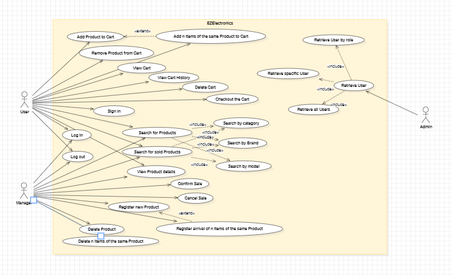
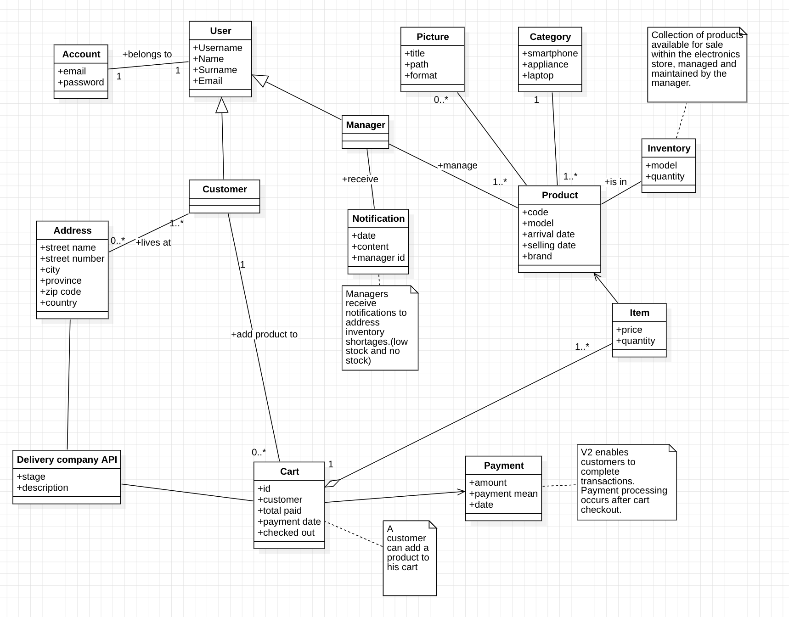
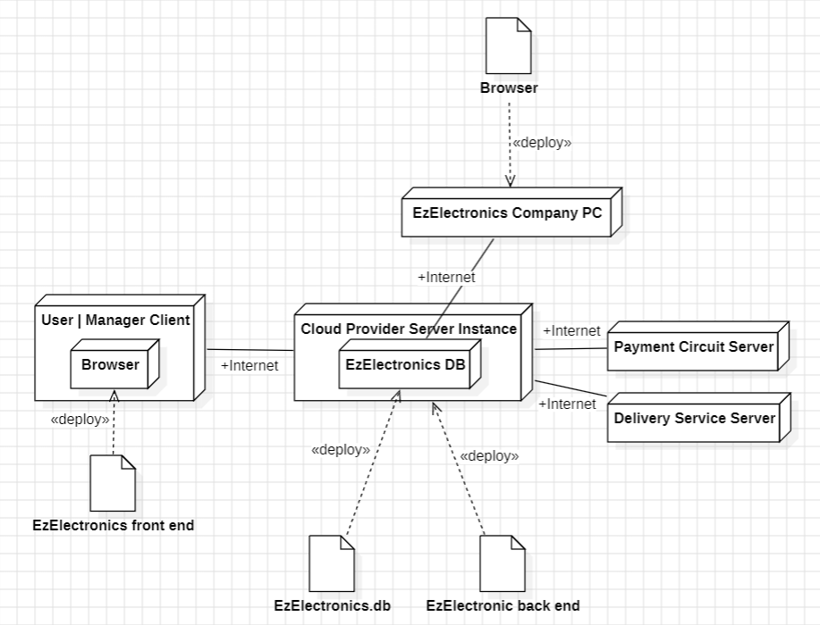

# Requirements Document - future EZElectronics

Date: 05/05/2024

Version: V2 - description of EZElectronics in FUTURE form (as proposed by the team)

| Version number |                                                                                Change                                                                                 |
| :------------: | :-------------------------------------------------------------------------------------------------------------------------------------------------------------------: |
|       1        |                                                                     Created Requirements Document                                                                     |
|       2        | Added Business Model and payment method for Customers,   Added delivery options and tracking,   Added product details, customer email,   Various QOL changes |

# Contents

- [Requirements Document - future EZElectronics](#requirements-document---future-ezelectronics)
- [Contents](#contents)
- [Informal description](#informal-description)
- [Stakeholders](#stakeholders)
- [Context Diagram and interfaces](#context-diagram-and-interfaces)
  - [Context Diagram](#context-diagram)
  - [Interfaces](#interfaces)
- [Stories and personas](#stories-and-personas)
- [Functional and non functional requirements](#functional-and-non-functional-requirements)
  - [Functional Requirements](#functional-requirements)
  - [Non Functional Requirements](#non-functional-requirements)
- [Use case diagram and use cases](#use-case-diagram-and-use-cases)
  - [Use case diagram](#use-case-diagram)
    - [Use case 1, UC1](#use-case-1-uc1)
      - [Scenario 1.1](#scenario-11)
      - [Scenario 1.2](#scenario-12)
      - [Scenario 1.x](#scenario-1x)
    - [Use case 2, UC2](#use-case-2-uc2)
    - [Use case x, UCx](#use-case-x-ucx)
- [Glossary](#glossary)
- [System Design](#system-design)
- [Deployment Diagram](#deployment-diagram)

# Informal description

EZElectronics (read EaSy Electronics) is a software application designed to help managers of electronics stores to manage their products and offer them to customers through a dedicated website. Managers can assess the available products, record new ones, and confirm purchases. Customers can see available products, add them to a cart and see the history of their past purchases.

#### Key Features and Improvements:

- Low Stock and No Stock Alerts: Managers receive notifications to address inventory shortages (GUI and email)
- Product Visuals: V2 improves the product browsing experience by incorporating images and brand information for each listed item.
- Total Stock Count: V2 provides a view of total stock counts for each model.
- Post-Checkout Payment: V2 enables customers to complete transactions. Payment processing occurs after cart checkout.
- Account Management: V2 add new fields for address and email information in user accounts.
- Delivery and status tracking: Using external postal companies, we provide customers delivery option with visibility into the status of their orders (easypost API)

# Stakeholders

|     Stakeholder name      |                                 Description                                 |
| :-----------------------: | :-------------------------------------------------------------------------: |
|         Customer          |                            Customer of the shop                             |
|          Manager          |                             Manager of the shop                             |
|     Product companies     |              Company producing the product sell on the website              |
|        Tech Admin         |                            Admin of the website                             |
|      Business admin       |                Responsible for the marketing of the product                 |
| EzElectronics dev company |                The company that develops the software itself                |
|        Competitors        | Other companies that want to develop similar softwares for the same purpose |
|       Control Team        |                    Check stock, check available product                     |
|      Cloud provider       |                    Provider for hosting the application                     |
|  Quality assurance team   |           Group of people responsible for testing the application           |
|      Payment Service      |                         For customer payment option                         |
|    Logistics Partners     |                       For show delivery stages option                       |

# Context Diagram and interfaces

## Context Diagram

## Interfaces

\<describe here each interface in the context diagram>

\<GUIs will be described graphically in a separate document>

|         Actor          |    Logical Interface     | Physical Interface |
| :--------------------: | :----------------------: | :----------------: |
|        Manager         |           GUI            |         PC         |
|        Customer        |           GUI            |         PC         |
|         Admin          |        GUI - code        |         PC         |
|      Control team      |           GUI            |         PC         |
|    Payment service     |   https://stripe.com/    |      Internet      |
|   Logistics Partners   | https://www.easypost.com |      Internet      |
| Quality assurance team |        GUI - code        |         PC         |

# Stories and personas

- Brenda is 43 y/o, and she is the manager in the electronics shop of her town. She has been working every day with great efficiency and constancy to reach this position. She has troubles keeping track of the different products in the shop and she always complains with her employees because they often forget to update the status orders of the items in the shop.

- Emily is a 28-year-old elementary school teacher who's passionate about education and technology. As a teacher, Emily seeks electronic products that can enhance her classroom teaching. Emily often browses the EzElectronic website during her free time. She explores categories like "Laptops". While Emily wants quality products, she's mindful of her budget as a teacher. She looks for good value options that fit within her classroom budget. If she finds a laptop that fits her needs, Emily adds it to her cart and continues browsing or proceeds to checkout.

# Functional and non functional requirements

## Functional Requirements

|   ID   | Description                                                                                                 |
| :----: | :---------------------------------------------------------------------------------------------------------- |
| _FR1_  | User Management                                                                                             |
| FR1.1  | Creates new User                                                                                            |
| FR1.2  | Retrieves all users                                                                                         |
| FR1.3  | Retrieves all users with a specific role                                                                    |
| FR1.4  | Retrieves specific user                                                                                     |
| FR1.5  | Deletes specific user                                                                                       |
| _FR2_  | User Authentication                                                                                         |
| FR2.1  | User Log_in/Log_out                                                                                         |
| _FR3_  | Cart Management                                                                                             |
| FR3.1  | Retrieves the cart for a specific user                                                                      |
| FR3.2  | Adds a product to the user's cart                                                                           |
| FR3.3  | Retrieves all carts/orders for a specific customer                                                          |
| FR3.4  | Removes a product from the user's cart                                                                      |
| FR3.5  | Deletes a specific cart                                                                                     |
| FR3.6  | Checks out a specific cart (as Customer)                                                                    |
| FR3.7  | Checks out a specific cart (as Manager)                                                                     |
| _FR4_  | Product Management                                                                                          |
| FR4.1  | Registers the arrival of a new set of products                                                              |
| FR4.2  | Registers the arrival of a single new product                                                               |
| FR4.3  | Marks a product as sold                                                                                     |
| FR4.4  | Marks a product as not_sold                                                                                 |
| FR4.5  | Returns all products, or only the ones that have been sold or not sold                                      |
| FR4.6  | Returns all products of a specific category, or only the ones that have been sold or not sold               |
| FR4.7  | Returns all products of a specific model, or only the ones that have been sold or not sold                  |
| FR4.8  | Returns all products of a specific brand, or only the ones that have been sold or not sold                  |
| FR4.9  | Deletes a specific product                                                                                  |
| FR4.10 | Returns a specific product by its code                                                                      |
| _FR5_  | Payment Management                                                                                          |
| FR5.1  | Require payment (ask name, surname, credit card details...)                                                 |
| FR5.2  | Manage payment information with a payment service (send, ask to check card, ask to debit, ask to credit...) |
| FR5.3  | Updates the payment status of a specific cart                                                               |
| FR5.4  | Updates the payment date for a specific cart                                                                |
| FR5.5  | Sends email confirmation for a successful payment                                                           |
| FR5.6  | Sends email confirmation for a rejected/unsuccessful payment                                                |
| _FR6_  | Delivery Management                                                                                         |
| FR6.1  | Chooses the delivery option (deliver to address / retrieve it from the shop)                                |
| FR6.2  | Manage delivery information                                                                                 |
| FR6.3  | Updates the delivery status of a specific cart                                                              |

## Table of rights

| Function |         Manager         |                Customer                 | Admin | Control Team | Payment Service | Logistics Partners | Quality Assurance Team |
| -------- | :---------------------: | :-------------------------------------: | ----- | ------------ | --------------- | ------------------ | ---------------------- |
| FR1      |           no            |               only FR1.1                | yes   | no           | no              | no                 | no                     |
| FR2      |           yes           |                   yes                   | no    | no           | no              | no                 | no                     |
| FR3      |  all but FR3.4, FR3.6   |              yes but FR3.7              | no    | no           | no              | no                 | no                     |
| FR4      |           yes           | only FR4.5, FR4.6, FR4.7, FR4.8, FR4.10 | no    | no           | no              | no                 | no                     |
| FR5      | all but FR5.4 and FR5.5 |               only FR5.1                | no    | no           | yes             | no                 | no                     |
| FR6      |           no            |               only FR6.1                | no    | no           | no              | all but FR6.1      | no                     |

## Non Functional Requirements

|  ID   | Type (efficiency, reliability, ..) |                                                                                Description                                                                                 |   Refers to   |
| :---: | :--------------------------------: | :------------------------------------------------------------------------------------------------------------------------------------------------------------------------: | :-----------: |
| NFR1  |             Efficiency             |                                                          The loading of the website should take less than 3 secs                                                           | All functions |
| NFR2  |             Efficiency             |                                                        All functions on the website should take less than 0.5 secs                                                         | All functions |
| NFR3  |             Usability              |                                    The Manager of the store should be able to use the website with no training in less than 10 minutes                                     |  FR1 and FR4  |
| NFR4  |             Usability              |                                                 The Client of the store should be able to use the website with no training                                                 |  FR2 and FR3  |
| NFR5  |            Portability             |                       The website should be compatible with different browsers (Chrome, Mozilla, Safari, Edge, Opera...) releases from at least 2023                       | All functions |
| NFR6  |            Portability             |                                   The website should be compatible with different devices (Desktops, laptops, tablets, and smartphones)                                    | All functions |
| NFR7  |            Availability            |                                   Availability of the service at least 95% (should manage well the communication with the local server)                                    |    ALL FR     |
| NFR8  |             Robustness             |                                                 The time to restart the website after a failure should be under 5 minutes                                                  |    ALL FR     |
| NFR9  |              Privacy               |                                             Employees and company private data should not be disclosed outside the application                                             |  FR2 and FR3  |
| NFR10 |               Domain               |                                                   The category of a product should only be Smartphone, Laptop, Appliance                                                   |      FR4      |
| NFR11 |               Domain               |                                                           The role of a user should only be Manager or Customer                                                            |      FR2      |
| NFR12 |              Security              |                                              During login a message should be sent if the inserted Username/Password is wrong                                              |      FR2      |
| NFR13 |              Security              |                              A 401 error message should be displayed if a user tries to access all the in-domain webpages without logging in                               |      FR2      |
| NFR14 |              Security              |                                              Employees and managers passwords should be encrypted when saved on the database                                               |      FR2      |
| NFR15 |              Security              |                                       An error message should be displayed if a user tries to sign in with an already used username                                        |      FR2      |
| NFR16 |             Usability              |                                              A warning message should be displayed if some products are low/no more in stock                                               |     FR2.1     |
| NFR17 |              Security              |    The integration with the external payment circuit should comply with industry-standard security protocols to ensure the protection of sensitive payment information     |      FR5      |
| NFR18 |              Security              | Data exchanged during the payment process should be encrypted using secure communication protocols (e.g., HTTPS) to prevent interception or tampering by malicious parties |      FR5      |
| NFR19 |            Reliability             |        The integration with the external delivery service's API should ensure reliable communication and data exchange to prevent order processing errors or delays        |      FR6      |
| NFR20 |            Reliability             |                                  The website should provide an error messages to users in the case of communication failures or timeouts                                   |      FR5      |
| NFR22 |            Performance             |                                                    Response times from external services should be less than 5 seconds                                                     |  FR5 and FR6  |
| NFR26 |             Usability              |                                     Error messages related to payment failures should be clear, guiding users on what was the problem                                      |  FR5 and FR6  |
| NFR27 |             Compliance             |               The integration with the external payment circuit should comply with relevant regulatory requirements and standards for handling customer data               |      FR5      |

# Use case diagram and use cases

## Use case diagram

### UC1 - Use Case 1: Add product to cart

| Actors Involved  |                          Customer                           |
| :--------------: | :---------------------------------------------------------: |
|   Precondition   | The user must be authenticated and a have "customer" (role)   The product is in inventory and has not already been sold   The Product is not in another customer cart |
|  Post condition  |        The cart contains the requested product        |
| Nominal Scenario |      The user add the product successfully to their cart      |
|     Variants     |           The user adds **n** items of the same Product to their cart            |
|    Exceptions    |     |

##### Scenario 1.1: Add 1 product to cart

|  Scenario 1.1  |                The user add 1 Product to their cart                |
| :------------: | :--------------------------------------------------------------: |
|  Precondition  |   The user must be authenticated and a have "customer" (role)   The product is in inventory and has not already been sold   The Product is not in another customer cart    |
| Post condition |          The cart should contain the requested product           |
|     Step#      |                         **Description**                          |
|       1        |                The customer navigates to "Product" section                |
|       2        |      The customer clicks on one product -> product details       |
|       3        |               The customer clicks on "Add to cart"               |
|       4        |         The system updates the cart and adds the product          |

##### Scenario 1.2: Add n items of a product to cart

|  Scenario 1.2  |           The user add n items of a product to their cart            |
| :------------: | :---------------------------------------------------------------: |
|  Precondition  |    The user must be authenticated and a have "customer" (role)   There are n available items for the Product   |
| Post condition |        The cart should contain the **n** requested product        |
|     Step#      |                          **Description**                          |
|       1        |                The customer navigates to "Product" section                 |
|       2        |                The customer clicks on one product -> product details                 |
|       3        |         The customer selects the number of items to add          |
|       4        |               The customer clicks on "Add to cart"                |
|       5        |         The system updates the cart and adds the products          |

### UC2 - Use case 2: Register a new product

| Actors Involved  |                                        Manager                                        |
| :--------------: | :-----------------------------------------------------------------------------------------: |
|   Precondition   |                     Manager is authenticated and has the "manager" role                     |
|  Post condition  |                           The new product is added to the inventory                        |
| Nominal Scenario |                The manager adds a new product with all required information                 |
|     Variants     |                   The manager adds a new product with additional details                    |
|    Exceptions    | Product with the same code already exists   Required fields are not filled out correctly |

##### Scenario 2.1: Register a new product

|  Scenario 2.1  |                   Manager adds a new product to the inventory                    |
| :------------: | :---------------------------------------------------------------------------: |
|  Precondition  |              Manager is authenticated and has the "manager" role              |
| Post condition |                    The new product is added to the inventory                 |
|     Step#      |                                **Description**                                |
|       1        |                  The manager navigates to "Product" section                   |
|       2        |               The manager selects on the "New arrival" dropdown               |
|       3        |                   The manager selects "Register a product"                    |
|       4        | The manager enters product information (sale price, model, category, arrival date, etc.) |
|       5        |                       The manager saves the new product                       |
|       6        |                 The system adds the product to the inventory                  |

### UC3 - Use Case 3: View Cart History

| Actors Involved  |                                  Customer                                  |
| :--------------: | :------------------------------------------------------------------------: |
|   Precondition   |         The customer is authenticated and has the "customer" role          |
|  Post condition  |                  The customer can view their cart history (only checked out carts), including the status of each checked out cart            |
| Nominal Scenario | The customer accesses and views their cart history  |
|     Variants     |        The customer accesses and views the status of one of their checked out carts     |
|    Exceptions    |                 No cart history available for the customer                 |

##### Scenario 3.1: View Cart history

|  Scenario 3.1  |                   Customer views cart history                   |
| :------------: | :-------------------------------------------------------------: |
|  Precondition  |    The customer is authenticated and has the "customer" role    |
| Post condition | The customer can view their cart history (only checked out carts) |
|     Step#      |                         **Description**                         |
|       1        |           The customer navigates to "History" section           |
|       2        |     The customer sees a list of their past checked out carts     |
|       3        |     The customer clicks on a specific cart to view details     |

##### Scenario 3.2: View checked out Cart status

|  Scenario 3.2  |                   Customer views checked out cart status                  |
| :------------: | :-------------------------------------------------------------: |
|  Precondition  |    The customer is authenticated and has the "customer" role    |
| Post condition | The customer can view the status of their checked out carts     |
|     Step#      |                         **Description**                         |
|       1        |           The customer navigates to "History" section           |
|       2        |     The customer sees a list of their past checked out carts     |
|       3        |     The customer sees the status of a checked out cart     |

### UC4 - Use Case 4: Register arrival of n items of the same Product

| Actors Involved  |                                           Manager                                           |
| :--------------: | :-----------------------------------------------------------------------------------------: |
|   Precondition   |                    The user is authenticated and has the "manager" role                     |
|  Post condition  |                         All the products are added to the inventory                      |
| Nominal Scenario |              The manager adds **n** items of the same product to the inventory              |
|     Variants     |                The manager adds 1 item of the same product to the inventory                 |
|    Exceptions    | Required fields are not filled out correctly |

##### Scenario 4.1: Register arrival of n items of the same Product

|  Scenario 4.1  |                          Manager views cart history                           |
| :------------: | :---------------------------------------------------------------------------: |
|  Precondition  |             The user is authenticated and has the "manager" role              |
| Post condition |                  All the products are added to the inventory               |
|     Step#      |                                **Description**                                |
|       1        |                  The manager navigates to "Product" section                   |
|       2        |               The manager selects on the "New arrival" dropdown               |
|       3        |               The manager selects "Register an arrival"                |
|       4        | The manager enters product information (sale price, model, category, arrival date, etc.) |
|       5        |       The manager enters the quantity of products in the arrival       |
|       6        |                         The manager save the arrival                          |
|       7        |      The system adds all the products to the inventory with different identification codes       |

### UC5 - Use Case 5: Delete Product from Inventory

| Actors Involved  |                       Manager                        |
| :--------------: | :--------------------------------------------------: |
|   Precondition   | The user is authenticated and has the "manager" role   Product exists in the inventory and has not already been sold   |
|  Post condition  |      The product is removed from the inventory       |
| Nominal Scenario |   The manager deletes a product from the inventory   |
|     Variants     |                                                      |
|    Exceptions    |              |

##### Scenario 5.1: Delete Product from Inventory

|  Scenario 5.1  |        Manager deletes a product from inventory        |
| :------------: | :----------------------------------------------------: |
|  Precondition  |  The user is authenticated and has the "manager" role   Product exists in the inventory and has not already been sold   |
| Post condition |       The product is removed from the inventory        |
|     Step#      |                    **Description**                     |
|       1        |       The manager navigates to "Product" section       |
|       2        |   The manager searches for the product to be deleted   |
|       3        | The manager selects the product to delete -> product details |
|       4        | The manager selects the deletion option |
|       5        |   The system removes the product from the inventory    |

### UC6 - Use Case 6: Delete all items of the same Product

| Actors Involved  |                      Manager, Customer                       |
| :--------------: | :----------------------------------------------------------: |
|   Precondition   |   The manager is authenticated and has the "manager" role   The product is in inventory and has not already been sold    |
|  Post condition  |       All items of the Product are been removed from inventory   |
| Nominal Scenario | The manager deletes all items of the same Product  |
|     Variants     |          |
|    Exceptions    |   |

##### Scenario 6.1: Delete all items of the same Product

|  Scenario 6.1  |        Manager deletes all items of the same Product      |
| :------------: | :---------------------------------------------------------: |
|  Precondition  |   The manager is authenticated and has the "manager" role   The product is in inventory and has not already been sold      |
| Post condition |      All items of the Product are been removed from inventory       |
|     Step#      |                       **Description**                       |
|       1        |         The manager navigates to "Product" section         |
|       2        |   The manager searches for the Product to delete   |
|       3        | The manager selects the option to delete all items of that Product |
|       4        | The system removes all items of the Product from the inventory |

### UC7 - Use Case 7: Search for Product

| Actors Involved  |                  Customer, Manager                   |
| :--------------: | :--------------------------------------------------: |
|   Precondition   |   The user is authenticated as customer or manager   |
|  Post condition  |   The search results for the product are displayed   |
| Nominal Scenario | The user searches for a product by model or category |
|     Variants     |    The manager searches for an already sold product by model or category                          |
|    Exceptions    |    Product not found   Invalid search criteria    |

##### Scenario 7.1: Search for Product by category

|  Scenario 7.1  |             User searches for a product by category              |
| :------------: | :--------------------------------------------------------------: |
|  Precondition  |         The user is authenticated as customer or manager         |
| Post condition |         The search results for the product are displayed         |
|     Step#      |                         **Description**                          |
|       1        |            The user navigates to the "Product" section |
|       2        | The user selects a category from a dropdown (such as "Smartphone") |
|       3        |        The system displays all the available products of selected category        |

##### Scenario 7.2: Search for Product by model

|  Scenario 7.2  |                  User searches for a product by model                  |
| :------------: | :--------------------------------------------------------------------: |
|  Precondition  |            The user is authenticated as customer or manager            |
| Post condition |            The search results for the product are displayed            |
|     Step#      |                            **Description**                             |
|       1        |               The user navigates to the "Product" section |
|       2        |                        The user enters a model                         |
|       3        | The system displays all the available products which model corresponds to the input |

##### Scenario 7.3: Search for Product by brand

|  Scenario 7.3  |                  User searches for a product by brand                  |
| :------------: | :--------------------------------------------------------------------: |
|  Precondition  |            The user is authenticated as customer or manager            |
| Post condition |            The search results for the product are displayed            |
|     Step#      |                            **Description**                             |
|       1        |               The user navigates to the "Product" section |
|       2        |                        The user enters a brand                         |
|       3        | The system displays all the available products which brand corresponds to the input |

##### Scenario 7.4: Search for already sold Product, by model, category or brand

|  Scenario 7.4  |                  User searches for a sold product by model, category or brand                  |
| :------------: | :--------------------------------------------------------------------: |
|  Precondition  |            The manager is authenticated as manager            |
| Post condition |            The search results for the product are displayed            |
|     Step#      |                            **Description**                             |
|       1        |               The manager navigates to the "Product" section               |
|       2        |                        The manager enters a model or a brand or selects a category                        |
|       3        | The manager checks the "sold" option to see only the already sold products  |
|       4        | The system displays all the already sold products which model or brand corresponds to the input or with the selected category |

### UC8 - Use Case 8: Checkout Cart

| Actors Involved  |                         Customer                          |
| :--------------: | :-------------------------------------------------------: |
|   Precondition   | The customer is authenticated and has the "customer" role |
|  Post condition  |             The cart is marked as checked out and added to the customer's cart history   Current cart is empty   A receipt is sended by mail to the customer         |
| Nominal Scenario |      The customer checks out the products in their cart and pays online the total price of their purchase    |
|     Variants     |               The customer checks out the products in their cart with the option to pay for them at the store |
|    Exceptions    | Cart is empty |

##### Scenario 8.1.1: Checkout Cart and pay online, with new address

|  Scenario 8.1.1  |                      Customer checks out the items in their cart and pays online, using new address                     |
| :------------: | :-----------------------------------------------------------------------------------: |
|  Precondition  |               The customer is authenticated and has the "customer" role              |
| Post condition |                           The cart is marked as checked out and added to the customer's cart history   Current cart is empty                          |
|     Step#      |                                    **Description**                                    |
|       1        |                    The customer navigates to their "Cart" section                     |
|       2        |          The customer reviews the items in the cart and clicks on "checkout"           |
|       3        |                       The customer confirms the checkout action                       |
|       4        |  The customer chooses the option to pay online |
|       5        |     The customer adds an address to their registered ones and uses it for the delivery  |
|       6        |      The customer chooses an option between the basic delivery and the fast one   |
|       7        |       The customer confirms the choices  |
|       8        | The customer enters their credit card information and confirms the payment |
|       9        | The system adds current cart to customer's cart history |
|       10       | Current cart is emptied |
|       11       | The system sends an email to customer address containing purchase receipt | 

##### Scenario 8.1.2: Checkout Cart and pay online, with registered address

|  Scenario 8.1.2  |                      Customer checks out the items in their cart and pays online, using registered address                     |
| :------------: | :-----------------------------------------------------------------------------------: |
|  Precondition  |               The customer is authenticated and has the "customer" role              |
| Post condition |                           The cart is marked as checked out and added to the customer's cart history   Current cart is empty                          |
|     Step#      |                                    **Description**                                    |
|       1        |                    The customer navigates to their "Cart" section                     |
|       2        |          The customer reviews the items in the cart and clicks on "checkout"           |
|       3        |                       The customer confirms the checkout action                       |
|       4        |  The customer chooses the option to pay online |
|       5        |     The customer chooses one of their related addresses    |
|       6        |      The customer chooses an option between the basic delivery and the fast one   |
|       7        |       The customer confirms the choices  |
|       8        | The customer enters their credit card information and confirms the payment |
|       9        | The system adds current cart to customer's cart history |
|       10       | Current cart is emptied |
|       11       | The system sends an email to customer address containing purchase receipt | 

##### Scenario 8.2: Checkout Cart and pay in store

|  Scenario 8.1  |                      Customer checks out the items in their cart and pays in store                   |
| :------------: | :-----------------------------------------------------------------------------------: |
|  Precondition  |               The customer is authenticated and has the "customer" role              |
| Post condition |                           The cart is marked as checked out and added to the customer's cart history   Current cart is empty                          |
|     Step#      |                                    **Description**                                    |
|       1        |                    The customer navigates to their "Cart" section                     |
|       2        |          The customer reviews the items in the cart and clicks on "checkout"           |
|       3        |                       The customer confirms the checkout action                       |
|       4        |  The customer chooses the option to pay in store |
|       7        |       The customer confirms the choices  |
|       8        | The system adds current cart to customer's cart history |
|       9       | Current cart is emptied |
|       10       | The system sends an email to customer address containing checkout log, including cart code | 

### UC9 - Use Case 9: Remove Product from Cart

| Actors Involved  |                         Customer                          |
| :--------------: | :-------------------------------------------------------: |
|   Precondition   | The customer is authenticated and has the "customer" role   The product is in the cart   The cart is not in the cart history |
|  Post condition  |           The product is removed from the cart            |
| Nominal Scenario |      The customer removes a product from their cart       |
|     Variants     |                                                           |
|    Exceptions    |                              |

##### Scenario 9.1: Remove Product from Cart

|  Scenario 9.1  |                      Customer removes a product from their cart                      |
| :------------: | :----------------------------------------------------------------------------------: |
|  Precondition  |              The customer is authenticated and has the "customer" role   The product is in the cart   The cart is not in the cart history              |
| Post condition |                         The product is removed from the cart                         |
|     Step#      |                                   **Description**                                    |
|       1        |                    The customer navigates to their "Cart" section                    |
|       2        | The customer selects the product to remove from the cart and clicks on the icon to remove it |
|       3        |                   The customer confirms the removal of the product                   |
|       4        |                     The system removes the product from the cart                     |

### UC10 - Use Case 10: Delete Cart

| Actors Involved  |                         Customer                          |
| :--------------: | :-------------------------------------------------------: |
|   Precondition   | The customer is authenticated and has the "customer" role |
|  Post condition  |            The cart is deleted from the inventory           |
| Nominal Scenario |              The customer deletes their cart              |
|     Variants     |                                                           |
|    Exceptions    |                   Cart is already empty                   |

##### Scenario 10.1: Delete Cart

| Scenario 10.1  |                Customer deletes their cart                |
| :------------: | :-------------------------------------------------------: |
|  Precondition  | The customer is authenticated and has the "customer" role |
| Post condition |            The cart is deleted from the inventory            |
|     Step#      |                      **Description**                      |
|       1        |      The customer navigates to their "Cart" section       |
|       2        |    The customer selects the option to delete the cart     |
|       3        |      The customer confirms the deletion of the cart       |
|       4        |        The system removes the cart from the inventory        |

### UC11 - Use Case 11: Login

| Actors Involved  |                         Customer, Manager |
| :--------------: | :-------------------------------------------------------: |
|   Precondition   | The user is registered to the system either as customer or manager |
|  Post condition  | The user is authenticated as customer or manager        |
| Nominal Scenario | The user insert his credentials and logs in  |
|     Variants     |       The user inserts their credentials and is authenticated as customer     The user insert his credentials and is authenticated as manager      |
|    Exceptions    |                The credentials are not valid                  |

##### Scenario 11.1: Customer logs in

| Scenario 11.1  |                Customer logs in               |
| :------------: | :-------------------------------------------------------: |
|  Precondition  | The customer is registered to the system as customer|
| Post condition |            The customer is authenticated as customer         |
|     Step#      |                      **Description**                      |
|       1        |      The customer navigates to the login page       |
|       2        |    The customer inserts their credentials (username, password) and confirms    |
|       3        |      The system authenticates the customer as customer      |

##### Scenario 11.2: Manager logs in 

| Scenario 11.2  |                Manager logs in               |
| :------------: | :-------------------------------------------------------: |
|  Precondition  | The manager is registered to the system as manager|
| Post condition |            The manager is authenticated as manager         |
|     Step#      |                      **Description**                      |
|       1        |      The manager navigates to the login page       |
|       2        |    The manager inserts their credentials (username, password) and confirms   |
|       3        |      The system authenticates the manager as manager     |

### UC12 - Use Case 12: Sign in

| Actors Involved  |                         Customer                              |
| :--------------: | :-------------------------------------------------------: |
|   Precondition   | The Customer has an Internet connection |
|  Post condition  | The Customer is registered to the system        |
| Nominal Scenario | The Customer inserts their credentials (username, password, name, surname, email, address) and signs in as a customer  |
|     Variants     | |
|    Exceptions    |                 The credentials are not valid                |

##### Scenario 12.1: Customer signs in

| Scenario 12.1  |                Customer signs in               |
| :------------: | :-------------------------------------------------------: |
|  Precondition  | The customer has an Internet connection|
| Post condition |            The customer is registered to the system         |
|     Step#      |                      **Description**                      |
|       1        |      The customer navigates to the login page       |
|       2        |    The customer inserts their credentials (username, password, name, surname, email, address) and confirms    |
|       3        |      The system registrates the customer as customer      |

### UC14 - Use Case 14: Logout

| Actors Involved  |                         Customer, Manager |
| :--------------: | :-------------------------------------------------------: |
|   Precondition   | The user is authenticated to the system either as customer or manager |
|  Post condition  | The user is no more authenticated as customer or manager and they are redirected to login page        |
| Nominal Scenario | The user logs out  |
|     Variants     |       The user is authenticated as customer and logs out   The user is authenticated as manager and logs out      |
|    Exceptions    |                          |

##### Scenario 14.1: Customer logs out

| Scenario 14.1  |                Customer logs out               |
| :------------: | :-------------------------------------------------------: |
|  Precondition  | The customer is authenticated to the system as customer|
| Post condition |            The customer is no more authenticated as customer and they are redirected to login page        |
|     Step#      |                      **Description**                      |
|       1        |      The customer navigates to any page       |
|       2        |    The customer selects logout option and confirms     |
|       3        |      The authentication of the customer expires      |

##### Scenario 14.2: Manager logs out 

| Scenario 14.2  |                Manager logs out               |
| :------------: | :-------------------------------------------------------: |
|  Precondition  | The manager is authenticated to the system as manager|
| Post condition |            The manager is no more authenticated as manager and they are redirected to login page        |
|     Step#      |                      **Description**                      |
|       1        |      The manager navigates to any page       |
|       2        |    The manager selects logout option and confirms   |
|       3        |      The authentication of the manager expires     |

### UC15 - Use Case 15: View Product details

| Actors Involved  |                          Customer, Manager                           |
| :--------------: | :---------------------------------------------------------: |
|   Precondition   | The user must be authenticated as customer or manager   The product is in inventory |
| Nominal Scenario |      The details of a selected Product are desplayed     |
|     Variants     |           The user reads the details of a selected Product            |
|    Exceptions    |     |

##### Scenario 15.1: View Product details 

|  Scenario 15.1  |                The user views Product details                |
| :------------: | :--------------------------------------------------------------: |
|  Precondition  |   The user must be authenticated as customer or manager   The product is in inventory  |
| Post condition |          The details of a selected Product are desplayed          |
|     Step#      |                         **Description**                          |
|       1        |                The user navigates to their "Product" section               |
|       2        |      The user clicks on one product -> product details       |
|       3        |               The user reads the details of the selected Product               |

### UC16 - Use Case 16: View Cart

| Actors Involved  |                                  Customer                                  |
| :--------------: | :------------------------------------------------------------------------: |
|   Precondition   |         The customer is authenticated and has the "customer" role          |
|  Post condition  |                  The customer can view their cart, including its total price            |
| Nominal Scenario | The customer accesses and reviews their cart |
|     Variants     |                               The customer accesses and views their cart's total price                                             |
|    Exceptions    |        |

##### Scenario 16.1: View Cart

|  Scenario 16.1  |                   Customer views cart                   |
| :------------: | :-------------------------------------------------------------: |
|  Precondition  |    The customer is authenticated and has the "customer" role    |
| Post condition | The customer can view their cart, including its total price |
|     Step#      |                         **Description**                         |
|       1        |           The customer navigates to "Cart" section           |
|       2        |     The customer sees their cart     |
|       3        |   The customer sees the total price of their current purchase |

### UC17 - Use Case 17: Confirm sale in store

| Actors Involved  |                                  Manager, Customer                                  |
| :--------------: | :------------------------------------------------------------------------: |
|   Precondition   |         The manager is authenticated and has the "manager" role   There is a checked out cart in manager's "Checkout" section          |
|  Post condition  |                  The paid cart is marked as confirmed             |
| Nominal Scenario | The manager accesses and confirms a checked out cart after customer payment in store |
|     Variants     |  |
|    Exceptions    |        |

##### Scenario 17.1: Confirm sale in store

|  Scenario 17.1  |                   Manager confirms a sale in store                   |
| :------------: | :-------------------------------------------------------------: |
|  Precondition  |     The manager is authenticated and has the "manager" role   There is a checked out cart in manager's "Checkout" section     |
| Post condition | The paid cart is marked as confirmed |
|     Step#      |                         **Description**                         |
|       1        |  The customer provide their cart code and their name to the manager |
|       1        |           The manager navigates to "Checkout" section           |
|       2        |     The manager search for the checked out cart with the provided code and customer name  |
|       3        |   The manager selects the option to confirm the sale |
|       4        |    The cart is marked as confirmed in manager's "Checkout" section and as collected in customer's cart history |

### UC18 - Use Case 18: Cancel sale in store

| Actors Involved  |                                  Manager                               |
| :--------------: | :------------------------------------------------------------------------: |
|   Precondition   |         The manager is authenticated and has the "manager" role   There is a checked out cart in manager's "Checkout" section          |
|  Post condition  |                  The ckecked out cart is marked as canceled            |
| Nominal Scenario | The manager cancels the checked out cart from "Checkout" section after some time the customer doesn't collect their purchase in store   |
|     Variants     |  |
|    Exceptions    |        |

##### Scenario 18.1: Cancel sale in store

|  Scenario 18.1  |                   Manager cancels a sale in store                   |
| :------------: | :-------------------------------------------------------------: |
|  Precondition  |     The manager is authenticated and has the "manager" role   There is a checked out cart in manager's "Checkout" section     |
| Post condition |  The ckecked out cart is marked as canceled |
|     Step#      |                         **Description**                         |
|       1        |  The manager navigates to "Checkout" section  |
|       2        |     The manager search for a checked out cart which customer didn't came to collect  |
|       3        |   The manager selects the option to cancel the sale |
|       4        |    The cart is marked as canceled in manager's "Checkout" section and in customer's cart history |

### UC19 - Use Case 19: Retrieve all users

| Actors Involved  |                                 Admin                              |
| :--------------: | :------------------------------------------------------------------------: |
|   Precondition   |         The admin is authenticated and has the "admin" role   There are users registered in the system          |
|  Post condition  |                  The system shows all selected users           |
| Nominal Scenario | The admin can see a list of all users in the system  |
|     Variants     |  The admin can see a list of all users in the system with a specific role    The admin can see a specific user |
|    Exceptions    |        |

##### Scenario 19.1: Retrieve all users

|  Scenario 19.1  |                  admin retrieves all users                  |
| :------------: | :-------------------------------------------------------------: |
|  Precondition  |     The admin is authenticated and has the "admin" role   There are users in the system          |
| Post condition |   The system shows all selected users   |
|     Step#      |                         **Description**                         |
|       1        |  The admin enters in their shell the command to retrieve all users |
|       2        |     The system prints a list of all selected users on the shell |

##### Scenario 19.2: Retrieve all users with specific role

|  Scenario 19.2  |                  admin retrieves all users with a specific role                  |
| :------------: | :-------------------------------------------------------------: |
|  Precondition  |     The admin is authenticated and has the "admin" role   There are users in the system          |
| Post condition |   The system shows all selected users   |
|     Step#      |                         **Description**                         |
|       1        |  The admin enters in their shell the command to retrieve all users  |
|       2        |    The admin adds a flag to select only users with a certain role |
|       3        |     The system prints a list of all selected users on the shell |

##### Scenario 19.3: Retrieve a specific user

|  Scenario 19.3  |                  admin retrieves a specific user                  |
| :------------: | :-------------------------------------------------------------: |
|  Precondition  |     The admin is authenticated and has the "admin" role   There are users in the system          |
| Post condition |   The system shows all selected users   |
|     Step#      |                         **Description**                         |
|       1        |  The admin enters in their shell the command to retrieve all users |
|       2        |     The admin adds a flag to select a specific user  |
|       3        |     The system prints a list of all selected users on the shell |

# Glossary

\<use UML class diagram to define important terms, or concepts in the domain of the application, and their relationships>

\<concepts must be used consistently all over the document, ex in use cases, requirements etc>

# System Design

Not required

# Deployment Diagram

